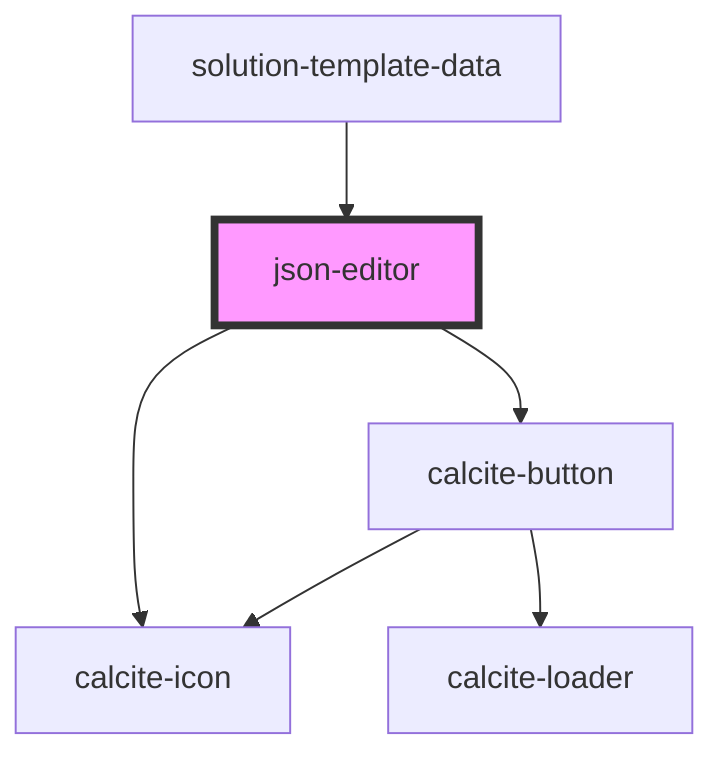

# json-editor

<!-- Auto Generated Below -->

## Properties

| Property     | Attribute    | Description                                                                                                                                                                                                                                                                                                                              | Type      | Default |
| ------------ | ------------ | ---------------------------------------------------------------------------------------------------------------------------------------------------------------------------------------------------------------------------------------------------------------------------------------------------------------------------------------- | --------- | ------- |
| `hasErrors`  | `has-errors` | Contains a public value to indicate if the model has any errors that would prevent saving it.                                                                                                                                                                                                                                            | `boolean` | `false` |
| `instanceid` | `instanceid` | Contains a unique identifier for when we have multiple instances of the editor. For example when we want to show an items data as well as an items properties.  Need to rethink this..would like it to be more generic. We are currently tied to either data or props as this helps us know how to get the correct model from the store. | `any`     | `""`    |
| `value`      | `value`      | Contains the public value for this component. This should be an item Id for one of the models in the store.                                                                                                                                                                                                                              | `any`     | `""`    |

## Methods

### `getValue() => Promise<any>`

#### Returns

Type: `Promise<any>`

### `replaceCurrentSelection(replacement: string) => Promise<any>`

#### Returns

Type: `Promise<any>`

### `reset() => Promise<any>`

#### Returns

Type: `Promise<any>`

## Dependencies

### Used by

 - [solution-template-data](../solution-template-data)

### Depends on

- calcite-icon
- calcite-button

### Graph

----------------------------------------------

*Built with [StencilJS](https://stenciljs.com/)*
