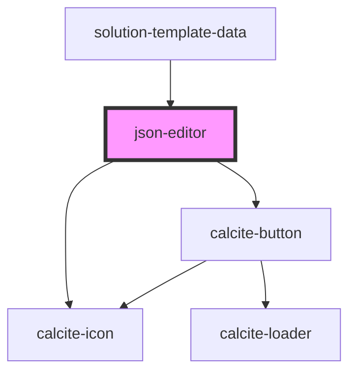

# json-editor

<!-- Auto Generated Below -->

## Properties

| Property     | Attribute    | Description                                                                                                                                                      | Type      | Default |
| ------------ | ------------ | ---------------------------------------------------------------------------------------------------------------------------------------------------------------- | --------- | ------- |
| `hasErrors`  | `has-errors` | Contains a public value to indicate if the model has any errors that would prevent saving it.                                                                    | `boolean` | `false` |
| `instanceid` | `instanceid` | Contains a unique identifier for when we have multiple instances of the editor. For example when we want to show an item's data as well as an item's properties. | `any`     | `""`    |
| `value`      | `value`      | Contains the public value for this component; it is not changed by the editor. When changed, the change overwrites the contents of the editor.                   | `any`     | `""`    |

## Methods

### `getEditorContents() => Promise<any>`

Gets the contents of the editor.

#### Returns

Type: `Promise<any>`

Promise resolving with the current contents of the editor

### `replaceCurrentSelection(replacement: string) => Promise<any>`

Replaces the current selection with the supplied text, inserting if nothing is selected.

#### Returns

Type: `Promise<any>`

Promise resolving when function is done

### `reset() => Promise<any>`

Resets the contents of the editor with the current `value`.

#### Returns

Type: `Promise<any>`

Promise resolving when function is done

## Dependencies

### Used by

 - [solution-template-data](../solution-template-data)

### Depends on

- calcite-icon
- calcite-button

### Graph

----------------------------------------------

*Built with [StencilJS](https://stenciljs.com/)*
