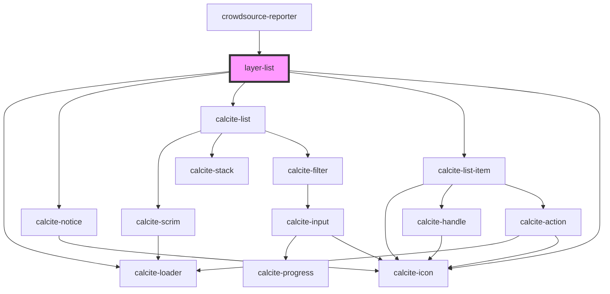

# feature-list

<!-- Auto Generated Below -->

## Properties

| Property           | Attribute            | Description                                                                                             | Type       | Default     |
| ------------------ | -------------------- | ------------------------------------------------------------------------------------------------------- | ---------- | ----------- |
| `layers`           | --                   | string[]: If passed will show only these layers in the list if they are present in map and are editable | `string[]` | `undefined` |
| `mapView`          | --                   | esri/views/View: https://developers.arcgis.com/javascript/latest/api-reference/esri-views-MapView.html  | `MapView`  | `undefined` |
| `showFeatureCount` | `show-feature-count` | boolean: if true display's feature count for each layer                                                 | `boolean`  | `true`      |
| `showNextIcon`     | `show-next-icon`     | boolean: If true display's arrow icon on each layer item                                                | `boolean`  | `false`     |

## Events

| Event              | Description                                                                                                                                          | Type                                                   |
| ------------------ | ---------------------------------------------------------------------------------------------------------------------------------------------------- | ------------------------------------------------------ |
| `layerSelect`      | Emitted on demand when feature layer clicked with details layerId and layerName                                                                      | `CustomEvent<{ layerId: string; layerName: string; }>` |
| `layersListLoaded` | Emitted on demand when list of layers to be listed are created. When empty array received in this event means no valid layers are found to be listed | `CustomEvent<string[]>`                                |

## Methods

### `refresh() => Promise<void>`

Refresh the layer list which will fetch the latest layer count and update the list

#### Returns

Type: `Promise<void>`

Promise that resolves when the operation is complete

## Dependencies

### Used by

 - [crowdsource-reporter](../crowdsource-reporter)

### Depends on

- calcite-loader
- calcite-notice
- calcite-list
- calcite-list-item
- calcite-icon

### Graph

----------------------------------------------

*Built with [StencilJS](https://stenciljs.com/)*
