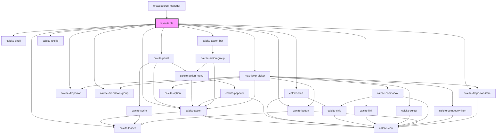

# layer-table

<!-- Auto Generated Below -->

## Properties

| Property  | Attribute | Description                                                                                            | Type      | Default     |
| --------- | --------- | ------------------------------------------------------------------------------------------------------ | --------- | ----------- |
| `mapView` | --        | esri/views/View: https://developers.arcgis.com/javascript/latest/api-reference/esri-views-MapView.html | `MapView` | `undefined` |

## Events

| Event                    | Description                                | Type                    |
| ------------------------ | ------------------------------------------ | ----------------------- |
| `featureSelectionChange` | Emitted on demand when a layer is selected | `CustomEvent<number[]>` |

## Methods

### `getSelectedGraphics() => Promise<__esri.Graphic[]>`

Get the selected graphics

#### Returns

Type: `Promise<Graphic[]>`

Promise that resolves when the operation is complete

## Dependencies

### Used by

 - [crowdsource-manager](../crowdsource-manager)

### Depends on

- calcite-shell
- calcite-panel
- calcite-loader
- calcite-alert
- calcite-link
- calcite-action-bar
- [map-layer-picker](../map-layer-picker)
- calcite-action
- calcite-tooltip
- calcite-button
- calcite-dropdown
- calcite-dropdown-group
- calcite-dropdown-item

### Graph

----------------------------------------------

*Built with [StencilJS](https://stenciljs.com/)*
