# layer-table

<!-- Auto Generated Below -->

## Properties

| Property                  | Attribute                     | Description                                                                                                        | Type                                      | Default     |
| ------------------------- | ----------------------------- | ------------------------------------------------------------------------------------------------------------------ | ----------------------------------------- | ----------- |
| `appLayout`               | `app-layout`                  | AppLayout: the current app layout                                                                                  | `"mapView" \| "splitView" \| "tableView"` | `undefined` |
| `createFilterModal`       | `create-filter-modal`         | boolean: create filter modal optional (default true) boolean value to create filter modal in layer table           | `boolean`                                 | `true`      |
| `defaultGlobalId`         | --                            | string: Global ID of the feature to select                                                                         | `string[]`                                | `undefined` |
| `defaultLayerId`          | `default-layer-id`            | string: when provided this layer ID will be used when the app loads                                                | `string`                                  | `undefined` |
| `defaultOid`              | --                            | number: when provided this will be used to select a feature in the table by default                                | `number[]`                                | `undefined` |
| `enableAutoRefresh`       | `enable-auto-refresh`         | boolean: when true the layer table will auto refresh the data                                                      | `boolean`                                 | `undefined` |
| `enableCSV`               | `enable-c-s-v`                | boolean: when true the export to csv button will be available                                                      | `boolean`                                 | `undefined` |
| `enableColumnReorder`     | `enable-column-reorder`       | boolean: when true the layer table will support drag/drop of columns to adjust order                               | `boolean`                                 | `true`      |
| `enableInlineEdit`        | `enable-inline-edit`          | boolean: when true edits can be applied directly within the table                                                  | `boolean`                                 | `undefined` |
| `enableShare`             | `enable-share`                | boolean: when true the share widget will be available                                                              | `boolean`                                 | `undefined` |
| `isMobile`                | `is-mobile`                   | When true the component will render an optimized view for mobile devices                                           | `boolean`                                 | `undefined` |
| `mapHidden`               | `map-hidden`                  | boolean: when true the map is hidden and map specific controls should be hidden                                    | `boolean`                                 | `undefined` |
| `mapInfo`                 | --                            | IMapInfo: key configuration details about the current map                                                          | `IMapInfo`                                | `undefined` |
| `mapView`                 | --                            | esri/views/View: https://developers.arcgis.com/javascript/latest/api-reference/esri-views-MapView.html             | `MapView`                                 | `undefined` |
| `onlyShowUpdatableLayers` | `only-show-updatable-layers`  | boolean: When true only editable layers that support the update capability will be available                       | `boolean`                                 | `undefined` |
| `selectedIds`             | --                            | number[]: A list of ids that are currently selected                                                                | `number[]`                                | `[]`        |
| `shareIncludeEmbed`       | `share-include-embed`         | boolean: When true the share options will include embed option                                                     | `boolean`                                 | `undefined` |
| `shareIncludeSocial`      | `share-include-social`        | boolean: When true the share options will include social media sharing                                             | `boolean`                                 | `undefined` |
| `showNewestFirst`         | `show-newest-first`           | boolean: when true the table will be sorted by objectid in descending order by default                             | `boolean`                                 | `undefined` |
| `zoomAndScrollToSelected` | `zoom-and-scroll-to-selected` | boolean: When true the selected feature will zoomed to in the map and the row will be scrolled to within the table | `boolean`                                 | `undefined` |
| `zoomToScale`             | `zoom-to-scale`               | number: default scale to zoom to when zooming to a single point feature                                            | `number`                                  | `undefined` |

## Events

| Event                    | Description                                     | Type                    |
| ------------------------ | ----------------------------------------------- | ----------------------- |
| `featureSelectionChange` | Emitted on demand when a layer is selected      | `CustomEvent<number[]>` |
| `toggleFilter`           | Emitted on demand when filter action is clicked | `CustomEvent<void>`     |

## Methods

### `closeFilter() => Promise<void>`

Closes the filter

#### Returns

Type: `Promise<void>`

### `filterReset() => Promise<void>`

Reset the filter

#### Returns

Type: `Promise<void>`

### `filterUpdate() => Promise<void>`

Updates the filter

#### Returns

Type: `Promise<void>`

### `refresh() => Promise<void>`

refresh the feature table

#### Returns

Type: `Promise<void>`

## Dependencies

### Used by

 - [crowdsource-manager](../crowdsource-manager)

### Depends on

- calcite-shell
- calcite-panel
- calcite-input
- calcite-loader
- calcite-action-bar
- [map-layer-picker](../map-layer-picker)
- calcite-dropdown
- calcite-dropdown-group
- calcite-dropdown-item
- calcite-action
- calcite-button
- instant-apps-social-share
- calcite-tooltip
- [delete-button](../delete-button)
- calcite-modal
- instant-apps-filter-list

### Graph

```mermaid
graph TD;
  layer-table --> calcite-shell
  layer-table --> calcite-panel
  layer-table --> calcite-input
  layer-table --> calcite-loader
  layer-table --> calcite-action-bar
  layer-table --> map-layer-picker
  layer-table --> calcite-dropdown
  layer-table --> calcite-dropdown-group
  layer-table --> calcite-dropdown-item
  layer-table --> calcite-action
  layer-table --> calcite-button
  layer-table --> instant-apps-social-share
  layer-table --> calcite-tooltip
  layer-table --> delete-button
  layer-table --> calcite-modal
  layer-table --> instant-apps-filter-list
  calcite-panel --> calcite-action
  calcite-panel --> calcite-action-menu
  calcite-panel --> calcite-scrim
  calcite-action --> calcite-loader
  calcite-action --> calcite-icon
  calcite-action-menu --> calcite-action
  calcite-action-menu --> calcite-popover
  calcite-popover --> calcite-action
  calcite-popover --> calcite-icon
  calcite-scrim --> calcite-loader
  calcite-input --> calcite-progress
  calcite-input --> calcite-icon
  calcite-action-bar --> calcite-action-group
  calcite-action-group --> calcite-action-menu
  calcite-action-group --> calcite-action
  map-layer-picker --> calcite-notice
  map-layer-picker --> calcite-tooltip
  map-layer-picker --> calcite-icon
  map-layer-picker --> calcite-label
  map-layer-picker --> calcite-select
  map-layer-picker --> calcite-combobox
  map-layer-picker --> calcite-dropdown
  map-layer-picker --> calcite-dropdown-group
  map-layer-picker --> calcite-action
  map-layer-picker --> calcite-button
  map-layer-picker --> calcite-combobox-item
  map-layer-picker --> calcite-option
  map-layer-picker --> calcite-dropdown-item
  calcite-notice --> calcite-icon
  calcite-select --> calcite-icon
  calcite-combobox --> calcite-combobox-item
  calcite-combobox --> calcite-chip
  calcite-combobox --> calcite-icon
  calcite-combobox-item --> calcite-icon
  calcite-chip --> calcite-icon
  calcite-button --> calcite-loader
  calcite-button --> calcite-icon
  calcite-dropdown-item --> calcite-icon
  instant-apps-social-share --> calcite-popover
  instant-apps-social-share --> calcite-button
  instant-apps-social-share --> calcite-icon
  instant-apps-social-share --> calcite-action
  delete-button --> calcite-button
  delete-button --> calcite-action
  delete-button --> calcite-tooltip
  delete-button --> calcite-modal
  calcite-modal --> calcite-scrim
  calcite-modal --> calcite-icon
  instant-apps-filter-list --> calcite-panel
  instant-apps-filter-list --> calcite-loader
  instant-apps-filter-list --> calcite-checkbox
  instant-apps-filter-list --> calcite-block
  instant-apps-filter-list --> calcite-combobox
  instant-apps-filter-list --> calcite-combobox-item
  instant-apps-filter-list --> calcite-slider
  instant-apps-filter-list --> calcite-input-date-picker
  instant-apps-filter-list --> calcite-action
  instant-apps-filter-list --> calcite-button
  calcite-block --> calcite-scrim
  calcite-block --> calcite-loader
  calcite-block --> calcite-icon
  calcite-block --> calcite-handle
  calcite-block --> calcite-action-menu
  calcite-handle --> calcite-icon
  calcite-slider --> calcite-graph
  calcite-input-date-picker --> calcite-input-text
  calcite-input-date-picker --> calcite-date-picker
  calcite-input-date-picker --> calcite-icon
  calcite-input-text --> calcite-progress
  calcite-input-text --> calcite-icon
  calcite-date-picker --> calcite-date-picker-month-header
  calcite-date-picker --> calcite-date-picker-month
  calcite-date-picker-month-header --> calcite-icon
  calcite-date-picker-month --> calcite-date-picker-day
  crowdsource-manager --> layer-table
  style layer-table fill:#f9f,stroke:#333,stroke-width:4px
```

----------------------------------------------

*Built with [StencilJS](https://stenciljs.com/)*
