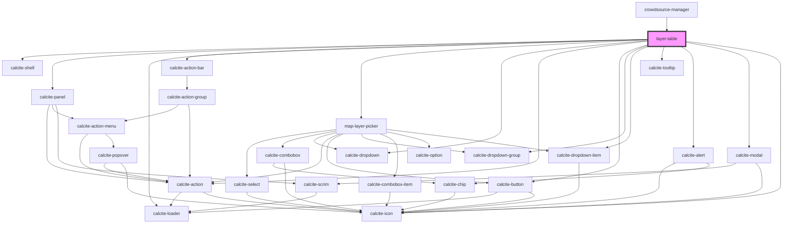

# layer-table

<!-- Auto Generated Below -->

## Properties

| Property                  | Attribute                     | Description                                                                                                        | Type       | Default     |
| ------------------------- | ----------------------------- | ------------------------------------------------------------------------------------------------------------------ | ---------- | ----------- |
| `enableAutoRefresh`       | `enable-auto-refresh`         | boolean: when true the layer table will auto refresh the data                                                      | `boolean`  | `undefined` |
| `enableInlineEdit`        | `enable-inline-edit`          | boolean: when true edits can be applied directly within the table                                                  | `boolean`  | `undefined` |
| `mapInfo`                 | --                            | IMapInfo: key configuration details about the current map                                                          | `IMapInfo` | `undefined` |
| `mapView`                 | --                            | esri/views/View: https://developers.arcgis.com/javascript/latest/api-reference/esri-views-MapView.html             | `MapView`  | `undefined` |
| `onlyShowUpdatableLayers` | `only-show-updatable-layers`  | boolean: When true only editable layers that support the update capability will be available                       | `boolean`  | `undefined` |
| `showNewestFirst`         | `show-newest-first`           | boolean: when true the table will be sorted by objectid in descending order by default                             | `boolean`  | `undefined` |
| `zoomAndScrollToSelected` | `zoom-and-scroll-to-selected` | boolean: When true the selected feature will zoomed to in the map and the row will be scrolled to within the table | `boolean`  | `undefined` |

## Events

| Event                    | Description                                | Type                    |
| ------------------------ | ------------------------------------------ | ----------------------- |
| `featureSelectionChange` | Emitted on demand when a layer is selected | `CustomEvent<number[]>` |

## Methods

### `getSelectedGraphics() => Promise<__esri.Graphic[]>`

Get the selected graphics

#### Returns

Type: `Promise<Graphic[]>`

Promise that resolves when the operation is complete

## Dependencies

### Used by

 - [crowdsource-manager](../crowdsource-manager)

### Depends on

- calcite-shell
- calcite-panel
- calcite-loader
- calcite-action-bar
- [map-layer-picker](../map-layer-picker)
- calcite-dropdown
- calcite-action
- calcite-button
- calcite-dropdown-group
- calcite-dropdown-item
- calcite-tooltip
- calcite-alert
- calcite-modal
- calcite-icon

### Graph

----------------------------------------------

*Built with [StencilJS](https://stenciljs.com/)*
