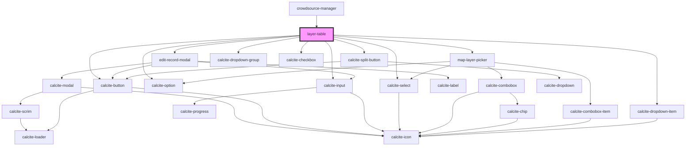

# layer-table

<!-- Auto Generated Below -->

## Properties

| Property  | Attribute | Description                                                                                            | Type      | Default     |
| --------- | --------- | ------------------------------------------------------------------------------------------------------ | --------- | ----------- |
| `mapView` | --        | esri/views/View: https://developers.arcgis.com/javascript/latest/api-reference/esri-views-MapView.html | `MapView` | `undefined` |

## Dependencies

### Used by

 - [crowdsource-manager](../crowdsource-manager)

### Depends on

- [edit-record-modal](../edit-record-modal)
- [map-layer-picker](../map-layer-picker)
- calcite-button
- calcite-split-button
- calcite-dropdown-group
- calcite-dropdown-item
- calcite-checkbox
- calcite-select
- calcite-option
- calcite-input

### Graph

----------------------------------------------

*Built with [StencilJS](https://stenciljs.com/)*
