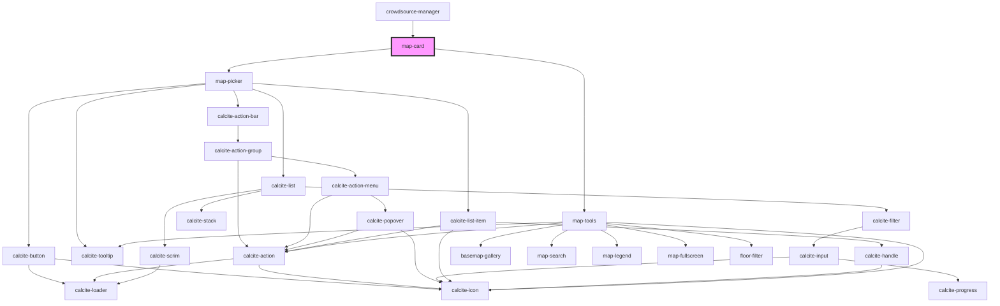

# map-card

<!-- Auto Generated Below -->

## Properties

| Property            | Attribute             | Description                                                                                            | Type                | Default     |
| ------------------- | --------------------- | ------------------------------------------------------------------------------------------------------ | ------------------- | ----------- |
| `basemapConfig`     | --                    | IBasemapConfig: List of any basemaps to filter out from the basemap widget                             | `IBasemapConfig`    | `undefined` |
| `enableBasemap`     | `enable-basemap`      | boolean: when true the basemap widget will be available                                                | `boolean`           | `undefined` |
| `enableFloorFilter` | `enable-floor-filter` | boolean: when true the floor filter widget will be available                                           | `boolean`           | `undefined` |
| `enableFullscreen`  | `enable-fullscreen`   | boolean: when true the fullscreen widget will be available                                             | `boolean`           | `undefined` |
| `enableHome`        | `enable-home`         | boolean: when true the home widget will be available                                                   | `boolean`           | `undefined` |
| `enableLegend`      | `enable-legend`       | boolean: when true the legend widget will be available                                                 | `boolean`           | `undefined` |
| `enableSearch`      | `enable-search`       | boolean: when true the search widget will be available                                                 | `boolean`           | `undefined` |
| `hidden`            | `hidden`              | boolean: When true the map display will be hidden                                                      | `boolean`           | `undefined` |
| `mapInfos`          | --                    | IMapInfo[]: array of map infos (name and id)                                                           | `IMapInfo[]`        | `[]`        |
| `mapView`           | --                    | esri/views/View: https://developers.arcgis.com/javascript/latest/api-reference/esri-views-MapView.html | `MapView`           | `undefined` |
| `theme`             | `theme`               | theme: "light" \| "dark" theme to be used                                                              | `"dark" \| "light"` | `undefined` |

## Events

| Event              | Description                        | Type                      |
| ------------------ | ---------------------------------- | ------------------------- |
| `beforeMapChanged` | Emitted before a new map is loaded | `CustomEvent<void>`       |
| `mapChanged`       | Emitted when a new map is loaded   | `CustomEvent<IMapChange>` |

## Dependencies

### Used by

 - [crowdsource-manager](../crowdsource-manager)

### Depends on

- [map-picker](../map-picker)
- [map-tools](../map-tools)

### Graph

----------------------------------------------

*Built with [StencilJS](https://stenciljs.com/)*
