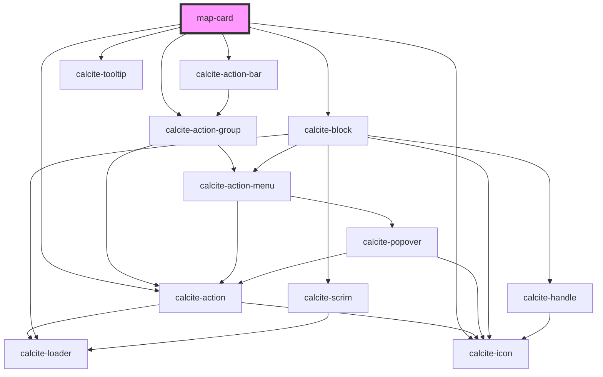

# map-card

<!-- Auto Generated Below -->

## Properties

| Property   | Attribute    | Description                                                                                            | Type      | Default     |
| ---------- | ------------ | ------------------------------------------------------------------------------------------------------ | --------- | ----------- |
| `mapView`  | --           | esri/views/View: https://developers.arcgis.com/javascript/latest/api-reference/esri-views-MapView.html | `MapView` | `undefined` |
| `webMapId` | `web-map-id` | string:                                                                                                | `string`  | `""`        |

## Dependencies

### Depends on

- calcite-action-bar
- calcite-action-group
- calcite-action
- calcite-icon
- calcite-tooltip
- calcite-block

### Graph

----------------------------------------------

*Built with [StencilJS](https://stenciljs.com/)*
