# map-card

<!-- Auto Generated Below -->

## Properties

| Property                  | Attribute                    | Description                                                                                                                                                                                                                                                                                     | Type                                                                                                                                                   | Default       |
| ------------------------- | ---------------------------- | ----------------------------------------------------------------------------------------------------------------------------------------------------------------------------------------------------------------------------------------------------------------------------------------------- | ------------------------------------------------------------------------------------------------------------------------------------------------------ | ------------- |
| `appProxies`              | `app-proxies`                | Array of objects containing proxy information for premium platform services.                                                                                                                                                                                                                    | `any`                                                                                                                                                  | `undefined`   |
| `basemapConfig`           | --                           | IBasemapConfig: List of any basemaps to filter out from the basemap widget                                                                                                                                                                                                                      | `IBasemapConfig`                                                                                                                                       | `undefined`   |
| `defaultLayerId`          | `default-layer-id`           | string: when provided this layer ID will be used when the app loads                                                                                                                                                                                                                             | `string`                                                                                                                                               | `undefined`   |
| `defaultWebmapId`         | `default-webmap-id`          | string: Item ID of the web map that should be selected by default when the app loads                                                                                                                                                                                                            | `string`                                                                                                                                               | `""`          |
| `enableBasemap`           | `enable-basemap`             | boolean: when true the basemap widget will be available                                                                                                                                                                                                                                         | `boolean`                                                                                                                                              | `undefined`   |
| `enableFloorFilter`       | `enable-floor-filter`        | boolean: when true the floor filter widget will be available                                                                                                                                                                                                                                    | `boolean`                                                                                                                                              | `undefined`   |
| `enableFullscreen`        | `enable-fullscreen`          | boolean: when true the fullscreen widget will be available                                                                                                                                                                                                                                      | `boolean`                                                                                                                                              | `undefined`   |
| `enableHome`              | `enable-home`                | boolean: when true the home widget will be available                                                                                                                                                                                                                                            | `boolean`                                                                                                                                              | `undefined`   |
| `enableLegend`            | `enable-legend`              | boolean: when true the legend widget will be available                                                                                                                                                                                                                                          | `boolean`                                                                                                                                              | `undefined`   |
| `enableSearch`            | `enable-search`              | boolean: when true the search widget will be available                                                                                                                                                                                                                                          | `boolean`                                                                                                                                              | `undefined`   |
| `enableSingleExpand`      | `enable-single-expand`       | boolean: when true map tools will be displayed within a single expand/collapse widget when false widgets will be loaded individually into expand widgets                                                                                                                                        | `boolean`                                                                                                                                              | `true`        |
| `hidden`                  | `hidden`                     | boolean: When true the map display will be hidden                                                                                                                                                                                                                                               | `boolean`                                                                                                                                              | `undefined`   |
| `homeZoomIndex`           | `home-zoom-index`            | number: The placement index of the home and zoom components. This index shows where to place the component relative to other components. For example a value of 0 would place it topmost when position is top-*, leftmost for bottom-left and right most for bottom-right.                      | `number`                                                                                                                                               | `3`           |
| `homeZoomPosition`        | `home-zoom-position`         | __esri.UIPosition: https://developers.arcgis.com/javascript/latest/api-reference/esri-views-ui-UI.html#UIPosition The position details for the Home and Zoom tools                                                                                                                              | `"bottom-leading" \| "bottom-left" \| "bottom-right" \| "bottom-trailing" \| "manual" \| "top-leading" \| "top-left" \| "top-right" \| "top-trailing"` | `"top-left"`  |
| `homeZoomToolsSize`       | `home-zoom-tools-size`       | "s" \| "m" \| "l": Used for Zoom and Home tools                                                                                                                                                                                                                                                 | `"l" \| "m" \| "s"`                                                                                                                                    | `"m"`         |
| `isMapLayout`             | `is-map-layout`              | boolean: When true map will shown is full screen                                                                                                                                                                                                                                                | `boolean`                                                                                                                                              | `undefined`   |
| `isMobile`                | `is-mobile`                  | When true the component will render an optimized view for mobile devices                                                                                                                                                                                                                        | `boolean`                                                                                                                                              | `undefined`   |
| `mapInfo`                 | --                           | IMapInfo: key configuration details about the current map                                                                                                                                                                                                                                       | `IMapInfo`                                                                                                                                             | `undefined`   |
| `mapInfos`                | --                           | IMapInfo[]: array of map infos (name and id)                                                                                                                                                                                                                                                    | `IMapInfo[]`                                                                                                                                           | `[]`          |
| `mapView`                 | --                           | esri/views/View: https://developers.arcgis.com/javascript/latest/api-reference/esri-views-MapView.html                                                                                                                                                                                          | `MapView`                                                                                                                                              | `undefined`   |
| `mapWidgetsIndex`         | `map-widgets-index`          | number: The placement index of the map widgets (legend, basemap, fullscreen etc). This index shows where to place the component relative to other components. For example a value of 0 would place it topmost when position is top-*, leftmost for bottom-left and right most for bottom-right. | `number`                                                                                                                                               | `0`           |
| `mapWidgetsPosition`      | `map-widgets-position`       | __esri.UIPosition: https://developers.arcgis.com/javascript/latest/api-reference/esri-views-ui-UI.html#UIPosition The position details for the Home and Zoom tools                                                                                                                              | `"bottom-leading" \| "bottom-left" \| "bottom-right" \| "bottom-trailing" \| "manual" \| "top-leading" \| "top-left" \| "top-right" \| "top-trailing"` | `"top-right"` |
| `mapWidgetsSize`          | `map-widgets-size`           | "s" \| "m" \| "l": Used for optional map tool widget                                                                                                                                                                                                                                            | `"l" \| "m" \| "s"`                                                                                                                                    | `"m"`         |
| `onlyShowUpdatableLayers` | `only-show-updatable-layers` | boolean: When true only editable layers that support the update capability will be available                                                                                                                                                                                                    | `boolean`                                                                                                                                              | `undefined`   |
| `selectedFeaturesIds`     | --                           | number[]: A list of ids that are currently selected                                                                                                                                                                                                                                             | `number[]`                                                                                                                                             | `undefined`   |
| `selectedLayer`           | --                           | __esri.FeatureLayer: Selected layer                                                                                                                                                                                                                                                             | `FeatureLayer`                                                                                                                                         | `undefined`   |
| `stackTools`              | `stack-tools`                | boolean: When true the map widget tools will have no margin between them. When false the map widget tools will have a margin between them.                                                                                                                                                      | `boolean`                                                                                                                                              | `true`        |
| `theme`                   | `theme`                      | theme: "light" \| "dark" theme to be used                                                                                                                                                                                                                                                       | `"dark" \| "light"`                                                                                                                                    | `undefined`   |
| `toolOrder`               | --                           |  Valid tools: "legend", "search", "fullscreen", "basemap", "floorfilter"                                                                                                                                                                                                                        | `string[]`                                                                                                                                             | `undefined`   |
| `zoomToScale`             | `zoom-to-scale`              | number: default scale to zoom to when zooming to a single point feature                                                                                                                                                                                                                         | `number`                                                                                                                                               | `undefined`   |

## Events

| Event              | Description                                              | Type                      |
| ------------------ | -------------------------------------------------------- | ------------------------- |
| `beforeMapChanged` | Emitted before a new map is loaded                       | `CustomEvent<void>`       |
| `clearSelection`   | Emitted on demand when clear selection button is clicked | `CustomEvent<void>`       |
| `mapChanged`       | Emitted when a new map is loaded                         | `CustomEvent<IMapChange>` |
| `toggleFilter`     | Emitted on demand when filter action is clicked          | `CustomEvent<void>`       |

## Methods

### `resetFilter() => Promise<void>`

Reset the filter

#### Returns

Type: `Promise<void>`

### `updateFilterState() => Promise<void>`

updates the filter

#### Returns

Type: `Promise<void>`

### `updateLayer() => Promise<void>`

updates the layer in map layer picker

#### Returns

Type: `Promise<void>`

## Dependencies

### Used by

 - [crowdsource-manager](../crowdsource-manager)

### Depends on

- [map-tools](../map-tools)
- calcite-action-bar
- [map-picker](../map-picker)
- [map-layer-picker](../map-layer-picker)
- calcite-dropdown
- calcite-action
- calcite-button
- calcite-dropdown-group
- calcite-dropdown-item
- calcite-loader
- calcite-tooltip

### Graph

```mermaid
graph TD;
  map-card --> map-tools
  map-card --> calcite-action-bar
  map-card --> map-picker
  map-card --> map-layer-picker
  map-card --> calcite-dropdown
  map-card --> calcite-action
  map-card --> calcite-button
  map-card --> calcite-dropdown-group
  map-card --> calcite-dropdown-item
  map-card --> calcite-loader
  map-card --> calcite-tooltip
  map-tools --> basemap-gallery
  map-tools --> map-search
  map-tools --> map-legend
  map-tools --> map-fullscreen
  map-tools --> floor-filter
  map-tools --> calcite-action
  map-tools --> calcite-icon
  map-tools --> calcite-tooltip
  calcite-action --> calcite-loader
  calcite-action --> calcite-icon
  calcite-action-bar --> calcite-action-group
  calcite-action-group --> calcite-action-menu
  calcite-action-group --> calcite-action
  calcite-action-menu --> calcite-action
  calcite-action-menu --> calcite-popover
  calcite-popover --> calcite-action
  calcite-popover --> calcite-icon
  map-picker --> calcite-button
  map-picker --> calcite-tooltip
  map-picker --> calcite-action-bar
  map-picker --> calcite-list
  map-picker --> calcite-list-item
  calcite-button --> calcite-loader
  calcite-button --> calcite-icon
  calcite-list --> calcite-scrim
  calcite-list --> calcite-stack
  calcite-list --> calcite-filter
  calcite-scrim --> calcite-loader
  calcite-filter --> calcite-input
  calcite-input --> calcite-progress
  calcite-input --> calcite-icon
  calcite-list-item --> calcite-icon
  calcite-list-item --> calcite-handle
  calcite-list-item --> calcite-action
  calcite-handle --> calcite-icon
  map-layer-picker --> calcite-notice
  map-layer-picker --> calcite-tooltip
  map-layer-picker --> calcite-icon
  map-layer-picker --> calcite-label
  map-layer-picker --> calcite-select
  map-layer-picker --> calcite-combobox
  map-layer-picker --> calcite-dropdown
  map-layer-picker --> calcite-dropdown-group
  map-layer-picker --> calcite-action
  map-layer-picker --> calcite-button
  map-layer-picker --> calcite-combobox-item
  map-layer-picker --> calcite-option
  map-layer-picker --> calcite-dropdown-item
  calcite-notice --> calcite-icon
  calcite-select --> calcite-icon
  calcite-combobox --> calcite-combobox-item
  calcite-combobox --> calcite-chip
  calcite-combobox --> calcite-icon
  calcite-combobox-item --> calcite-icon
  calcite-chip --> calcite-icon
  calcite-dropdown-item --> calcite-icon
  crowdsource-manager --> map-card
  style map-card fill:#f9f,stroke:#333,stroke-width:4px
```

----------------------------------------------

*Built with [StencilJS](https://stenciljs.com/)*
