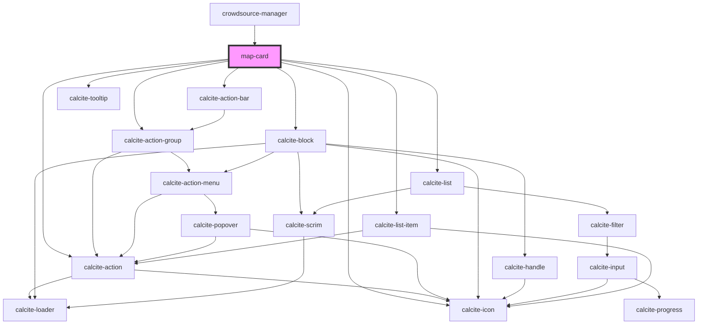

# map-card

<!-- Auto Generated Below -->

## Properties

| Property   | Attribute | Description                                                                                            | Type         | Default     |
| ---------- | --------- | ------------------------------------------------------------------------------------------------------ | ------------ | ----------- |
| `mapInfos` | --        | IMapInfo[]: array of map infos (name and id)                                                           | `IMapInfo[]` | `[]`        |
| `mapView`  | --        | esri/views/View: https://developers.arcgis.com/javascript/latest/api-reference/esri-views-MapView.html | `MapView`    | `undefined` |

## Events

| Event        | Description                               | Type                                                      |
| ------------ | ----------------------------------------- | --------------------------------------------------------- |
| `expandMap`  | Emitted when the expand button is clicked | `CustomEvent<EExpandType.COLLAPSE \| EExpandType.EXPAND>` |
| `mapChanged` | Emitted when a new map is loaded          | `CustomEvent<MapView>`                                    |

## Dependencies

### Used by

 - [crowdsource-manager](../crowdsource-manager)

### Depends on

- calcite-action-bar
- calcite-action-group
- calcite-action
- calcite-icon
- calcite-tooltip
- calcite-block
- calcite-list
- calcite-list-item

### Graph

----------------------------------------------

*Built with [StencilJS](https://stenciljs.com/)*
