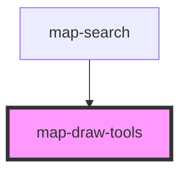

# map-draw-tools

<!-- Auto Generated Below -->

## Properties

| Property       | Attribute      | Description                                                                                                 | Type      | Default     |
| -------------- | -------------- | ----------------------------------------------------------------------------------------------------------- | --------- | ----------- |
| `mapView`      | --             | esri/views/View: https://developers.arcgis.com/javascript/latest/api-reference/esri-views-MapView.html      | `MapView` | `undefined` |
| `portal`       | --             | esri/portal/Portal: https://developers.arcgis.com/javascript/latest/api-reference/esri-portal-Portal.html   | `Portal`  | `undefined` |
| `sketchWidget` | --             | esri/widgets/Sketch: https://developers.arcgis.com/javascript/latest/api-reference/esri-widgets-Sketch.html | `Sketch`  | `undefined` |
| `translations` | `translations` | Contains the translations for this component.                                                               | `any`     | `{}`        |

## Dependencies

### Used by

 - [map-search](../map-search)

### Graph

----------------------------------------------

*Built with [StencilJS](https://stenciljs.com/)*
