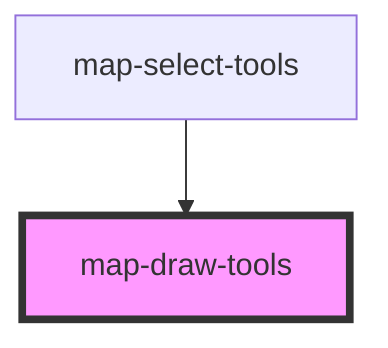

# map-draw-tools

<!-- Auto Generated Below -->

## Properties

| Property         | Attribute         | Description                                                                                                 | Type        | Default     |
| ---------------- | ----------------- | ----------------------------------------------------------------------------------------------------------- | ----------- | ----------- |
| `graphics`       | --                |                                                                                                             | `Graphic[]` | `undefined` |
| `mapView`        | --                | esri/views/View: https://developers.arcgis.com/javascript/latest/api-reference/esri-views-MapView.html      | `MapView`   | `undefined` |
| `pointSymbol`    | `point-symbol`    |                                                                                                             | `any`       | `undefined` |
| `polygonSymbol`  | `polygon-symbol`  |                                                                                                             | `any`       | `undefined` |
| `polylineSymbol` | `polyline-symbol` |                                                                                                             | `any`       | `undefined` |
| `portal`         | --                | esri/portal/Portal: https://developers.arcgis.com/javascript/latest/api-reference/esri-portal-Portal.html   | `Portal`    | `undefined` |
| `sketchWidget`   | --                | esri/widgets/Sketch: https://developers.arcgis.com/javascript/latest/api-reference/esri-widgets-Sketch.html | `Sketch`    | `undefined` |
| `translations`   | `translations`    | Contains the translations for this component.                                                               | `any`       | `{}`        |

## Events

| Event                  | Description | Type               |
| ---------------------- | ----------- | ------------------ |
| `sketchGraphicsChange` |             | `CustomEvent<any>` |

## Methods

### `clear() => Promise<void>`

#### Returns

Type: `Promise<void>`

## Dependencies

### Used by

 - [map-select-tools](../map-select-tools)

### Graph

----------------------------------------------

*Built with [StencilJS](https://stenciljs.com/)*
