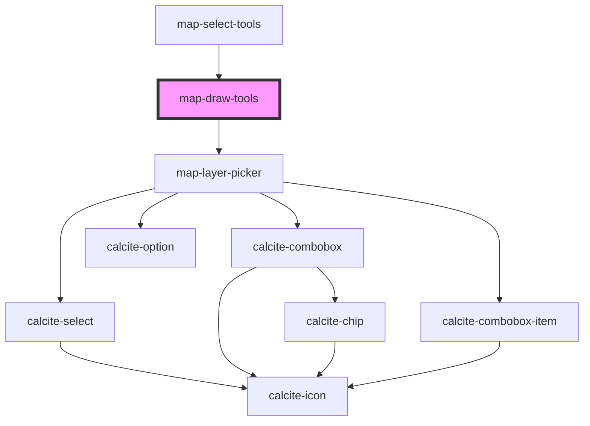

# map-draw-tools

<!-- Auto Generated Below -->

## Properties

| Property          | Attribute          | Description                                                                                                                                                                                       | Type                                           | Default     |
| ----------------- | ------------------ | ------------------------------------------------------------------------------------------------------------------------------------------------------------------------------------------------- | ---------------------------------------------- | ----------- |
| `active`          | `active`           | boolean: sketch is used by multiple components...need a way to know who should respond...                                                                                                         | `boolean`                                      | `false`     |
| `drawToolsMode`   | `draw-tools-mode`  | EDrawToolsMode: Will the drawn graphic select features from the addressee layer (DRAW) or  from a select layer whose features will then be used select features from the addressee layer (SELECT) | `EDrawToolsMode.DRAW \| EDrawToolsMode.SELECT` | `undefined` |
| `enabledLayerIds` | --                 | string[]: Optional list of enabled layer ids  If empty all layers will be available                                                                                                               | `string[]`                                     | `[]`        |
| `graphics`        | --                 | esri/Graphic: https://developers.arcgis.com/javascript/latest/api-reference/esri-Graphic.html                                                                                                     | `Graphic[]`                                    | `undefined` |
| `layerView`       | --                 | esri/views/layers/LayerView: https://developers.arcgis.com/javascript/latest/api-reference/esri-views-layers-LayerView.html                                                                       | `FeatureLayerView`                             | `undefined` |
| `layerViews`      | --                 | esri/views/layers/FeatureLayerView: https://developers.arcgis.com/javascript/latest/api-reference/esri-views-layers-FeatureLayerView.html                                                         | `FeatureLayerView[]`                           | `[]`        |
| `mapView`         | --                 | esri/views/View: https://developers.arcgis.com/javascript/latest/api-reference/esri-views-MapView.html                                                                                            | `MapView`                                      | `undefined` |
| `pointSymbol`     | --                 | esri/symbols/SimpleMarkerSymbol: https://developers.arcgis.com/javascript/latest/api-reference/esri-symbols-SimpleMarkerSymbol.html                                                               | `SimpleMarkerSymbol`                           | `undefined` |
| `polygonSymbol`   | --                 | esri/symbols/SimpleFillSymbol: https://developers.arcgis.com/javascript/latest/api-reference/esri-symbols-SimpleFillSymbol.html                                                                   | `SimpleFillSymbol`                             | `undefined` |
| `polylineSymbol`  | --                 | esri/symbols/SimpleLineSymbol: https://developers.arcgis.com/javascript/latest/api-reference/esri-symbols-SimpleLineSymbol.html                                                                   | `SimpleLineSymbol`                             | `undefined` |
| `useLayerPicker`  | `use-layer-picker` | boolean: Used to control the visibility of the layer picker                                                                                                                                       | `boolean`                                      | `true`      |

## Events

| Event                    | Description                                        | Type                                 |
| ------------------------ | -------------------------------------------------- | ------------------------------------ |
| `selectionLoadingChange` | Emitted on demand when selection starts or ends.   | `CustomEvent<boolean>`               |
| `sketchGraphicsChange`   | Emitted on demand when the sketch graphics change. | `CustomEvent<ISketchGraphicsChange>` |

## Methods

### `clear() => Promise<void>`

Clears the user drawn graphics

#### Returns

Type: `Promise<void>`

Promise that resolves when the operation is complete

## Dependencies

### Used by

 - [map-select-tools](../map-select-tools)

### Depends on

- [map-layer-picker](../map-layer-picker)

### Graph

----------------------------------------------

*Built with [StencilJS](https://stenciljs.com/)*
