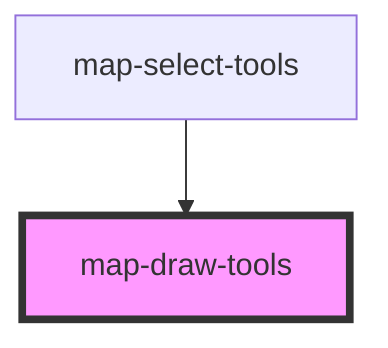

# map-draw-tools

<!-- Auto Generated Below -->

## Properties

| Property         | Attribute      | Description                                                                                                                         | Type                 | Default     |
| ---------------- | -------------- | ----------------------------------------------------------------------------------------------------------------------------------- | -------------------- | ----------- |
| `active`         | `active`       | boolean: sketch is used by multiple components...need a way to know who should respond...                                           | `boolean`            | `false`     |
| `graphics`       | --             | esri/Graphic: https://developers.arcgis.com/javascript/latest/api-reference/esri-Graphic.html                                       | `Graphic[]`          | `undefined` |
| `mapView`        | --             | esri/views/View: https://developers.arcgis.com/javascript/latest/api-reference/esri-views-MapView.html                              | `MapView`            | `undefined` |
| `pointSymbol`    | --             | esri/symbols/SimpleMarkerSymbol: https://developers.arcgis.com/javascript/latest/api-reference/esri-symbols-SimpleMarkerSymbol.html | `SimpleMarkerSymbol` | `undefined` |
| `polygonSymbol`  | --             | esri/symbols/SimpleFillSymbol: https://developers.arcgis.com/javascript/latest/api-reference/esri-symbols-SimpleFillSymbol.html     | `SimpleFillSymbol`   | `undefined` |
| `polylineSymbol` | --             | esri/symbols/SimpleLineSymbol: https://developers.arcgis.com/javascript/latest/api-reference/esri-symbols-SimpleLineSymbol.html     | `SimpleLineSymbol`   | `undefined` |
| `sketchWidget`   | --             | esri/widgets/Sketch: https://developers.arcgis.com/javascript/latest/api-reference/esri-widgets-Sketch.html                         | `Sketch`             | `undefined` |
| `translations`   | `translations` | Contains the translations for this component. All UI strings should be defined here.                                                | `any`                | `{}`        |

## Events

| Event                  | Description | Type               |
| ---------------------- | ----------- | ------------------ |
| `sketchGraphicsChange` |             | `CustomEvent<any>` |

## Methods

### `clear() => Promise<void>`

#### Returns

Type: `Promise<void>`

## Dependencies

### Used by

 - [map-select-tools](../map-select-tools)

### Graph

----------------------------------------------

*Built with [StencilJS](https://stenciljs.com/)*
