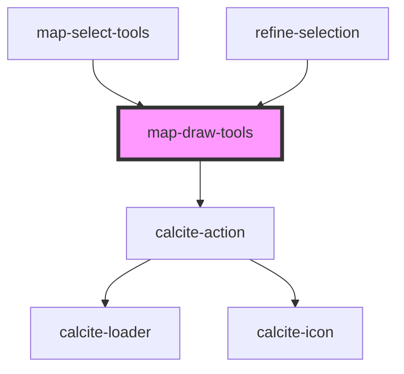

# map-draw-tools

<!-- Auto Generated Below -->

## Properties

| Property         | Attribute   | Description                                                                                                                         | Type                                   | Default            |
| ---------------- | ----------- | ----------------------------------------------------------------------------------------------------------------------------------- | -------------------------------------- | ------------------ |
| `active`         | `active`    | boolean: sketch is used by multiple components...need a way to know who should respond...                                           | `boolean`                              | `false`            |
| `drawMode`       | `draw-mode` | utils/interfaces: Controls how the draw tools are rendered  SKETCH mode supports snapping REFINE mode supports undo/redo            | `EDrawMode.REFINE \| EDrawMode.SKETCH` | `EDrawMode.SKETCH` |
| `graphics`       | --          | esri/Graphic: https://developers.arcgis.com/javascript/latest/api-reference/esri-Graphic.html                                       | `Graphic[]`                            | `undefined`        |
| `mapView`        | --          | esri/views/View: https://developers.arcgis.com/javascript/latest/api-reference/esri-views-MapView.html                              | `MapView`                              | `undefined`        |
| `pointSymbol`    | --          | esri/symbols/SimpleMarkerSymbol: https://developers.arcgis.com/javascript/latest/api-reference/esri-symbols-SimpleMarkerSymbol.html | `SimpleMarkerSymbol`                   | `undefined`        |
| `polygonSymbol`  | --          | esri/symbols/SimpleFillSymbol: https://developers.arcgis.com/javascript/latest/api-reference/esri-symbols-SimpleFillSymbol.html     | `SimpleFillSymbol`                     | `undefined`        |
| `polylineSymbol` | --          | esri/symbols/SimpleLineSymbol: https://developers.arcgis.com/javascript/latest/api-reference/esri-symbols-SimpleLineSymbol.html     | `SimpleLineSymbol`                     | `undefined`        |

## Events

| Event                    | Description                                        | Type                                 |
| ------------------------ | -------------------------------------------------- | ------------------------------------ |
| `drawRedo`               |                                                    | `CustomEvent<void>`                  |
| `drawUndo`               |                                                    | `CustomEvent<void>`                  |
| `selectionLoadingChange` | Emitted on demand when selection starts or ends.   | `CustomEvent<boolean>`               |
| `sketchGraphicsChange`   | Emitted on demand when the sketch graphics change. | `CustomEvent<ISketchGraphicsChange>` |

## Methods

### `clear() => Promise<void>`

Clears the user drawn graphics

#### Returns

Type: `Promise<void>`

Promise that resolves when the operation is complete

## Dependencies

### Used by

 - [map-select-tools](../map-select-tools)
 - [refine-selection](../refine-selection)

### Depends on

- calcite-action

### Graph

----------------------------------------------

*Built with [StencilJS](https://stenciljs.com/)*
