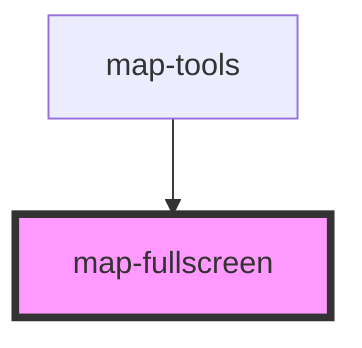

# map-fullscreen

<!-- Auto Generated Below -->

## Properties

| Property           | Attribute | Description                                                                                                         | Type         | Default     |
| ------------------ | --------- | ------------------------------------------------------------------------------------------------------------------- | ------------ | ----------- |
| `fullscreenWidget` | --        | esri/widgets/Fullscreen: https://developers.arcgis.com/javascript/latest/api-reference/esri-widgets-Fullscreen.html | `Fullscreen` | `undefined` |
| `mapView`          | --        | esri/views/MapView: https://developers.arcgis.com/javascript/latest/api-reference/esri-views-MapView.html           | `MapView`    | `undefined` |

## Events

| Event                   | Description                                                    | Type                  |
| ----------------------- | -------------------------------------------------------------- | --------------------- |
| `fullscreenStateChange` | Emitted on demand when the fullscreen widget state has changed | `CustomEvent<string>` |

## Dependencies

### Used by

 - [map-tools](../map-tools)

### Graph

----------------------------------------------

*Built with [StencilJS](https://stenciljs.com/)*
