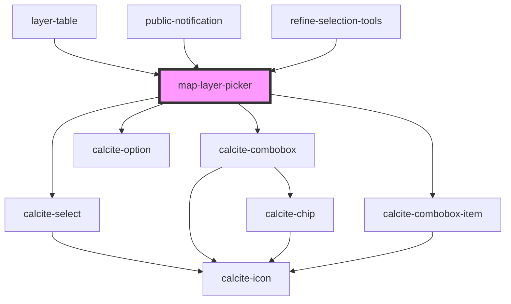

# map-layer-picker

<!-- Auto Generated Below -->

## Properties

| Property         | Attribute        | Description                                                                                                           | Type                  | Default     |
| ---------------- | ---------------- | --------------------------------------------------------------------------------------------------------------------- | --------------------- | ----------- |
| `enabledLayers`  | --               | string[]: Optional list of enabled layers  If empty all layers will be available                                      | `string[]`            | `[]`        |
| `mapView`        | --               | esri/views/View: https://developers.arcgis.com/javascript/latest/api-reference/esri-views-MapView.html                | `MapView`             | `undefined` |
| `selectedLayers` | --               | string[]: list of layers that have been selected by the end user                                                      | `string[]`            | `[]`        |
| `selectionMode`  | `selection-mode` | SelectionMode: "single" \| "multi"  Should the component support selection against a single layer or multiple layers. | `"multi" \| "single"` | `"single"`  |

## Events

| Event                  | Description                                | Type                    |
| ---------------------- | ------------------------------------------ | ----------------------- |
| `layerSelectionChange` | Emitted on demand when a layer is selected | `CustomEvent<string[]>` |

## Dependencies

### Used by

 - [layer-table](../layer-table)
 - [public-notification](../public-notification)
 - [refine-selection-tools](../refine-selection-tools)

### Depends on

- calcite-select
- calcite-combobox
- calcite-combobox-item
- calcite-option

### Graph

----------------------------------------------

*Built with [StencilJS](https://stenciljs.com/)*
