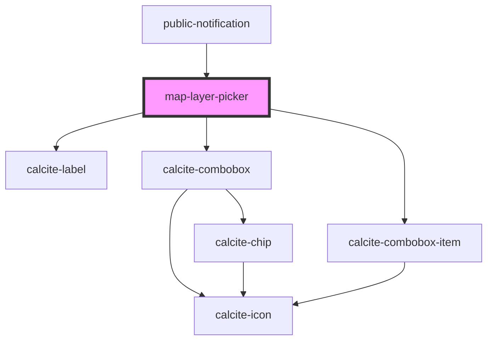

# map-layer-picker

<!-- Auto Generated Below -->

## Properties

| Property       | Attribute      | Description                                                                                               | Type      | Default     |
| -------------- | -------------- | --------------------------------------------------------------------------------------------------------- | --------- | ----------- |
| `mapView`      | --             | esri/views/View: https://developers.arcgis.com/javascript/latest/api-reference/esri-views-MapView.html    | `MapView` | `undefined` |
| `portal`       | --             | esri/portal/Portal: https://developers.arcgis.com/javascript/latest/api-reference/esri-portal-Portal.html | `Portal`  | `undefined` |
| `translations` | `translations` | Contains the translations for this component.                                                             | `any`     | `{}`        |

## Dependencies

### Used by

 - [public-notification](../public-notification)

### Depends on

- calcite-label
- calcite-combobox
- calcite-combobox-item

### Graph

----------------------------------------------

*Built with [StencilJS](https://stenciljs.com/)*
