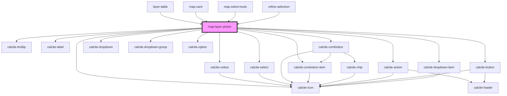

# map-layer-picker

<!-- Auto Generated Below -->

## Properties

| Property                  | Attribute                    | Description                                                                                                                       | Type                                   | Default          |
| ------------------------- | ---------------------------- | --------------------------------------------------------------------------------------------------------------------------------- | -------------------------------------- | ---------------- |
| `appearance`              | `appearance`                 | "transparent" \| "solid": controls the button appearance when using the "dropdown" type                                           | `"solid" \| "transparent"`             | `"transparent"`  |
| `defaultLayerId`          | `default-layer-id`           | string: when provided this layer ID will be used when the app loads                                                               | `string`                               | `""`             |
| `display`                 | `display`                    | "inline-flex" \| "inline-block": controls the display style of the dropdown                                                       | `"inline-block" \| "inline-flex"`      | `"inline-block"` |
| `enabledLayerIds`         | --                           | string[]: Optional list of enabled layer ids  If empty all layers will be available                                               | `string[]`                             | `[]`             |
| `enabledTableIds`         | --                           | string[]: Optional list of enabled table ids  If empty all tables will be available                                               | `string[]`                             | `[]`             |
| `height`                  | `height`                     | number: optional fixed height value for the control. Specified as pixel height.                                                   | `number`                               | `undefined`      |
| `isMobile`                | `is-mobile`                  | When true the component will render an optimized view for mobile devices                                                          | `boolean`                              | `undefined`      |
| `mapView`                 | --                           | esri/views/View: https://developers.arcgis.com/javascript/latest/api-reference/esri-views-MapView.html                            | `MapView`                              | `undefined`      |
| `onlyShowUpdatableLayers` | `only-show-updatable-layers` | boolean: When true only editable layers that support the update capability will be available                                      | `boolean`                              | `undefined`      |
| `placeholderIcon`         | `placeholder-icon`           | string: optional placeholder icon used with "combobox" type                                                                       | `string`                               | `""`             |
| `scale`                   | `scale`                      | "s" \| "m" \| "l": scale to render the component                                                                                  | `"l" \| "m" \| "s"`                    | `"m"`            |
| `selectedIds`             | --                           | string[]: list of layer ids that have been selected by the end user                                                               | `string[]`                             | `[]`             |
| `showSingleLayerAsLabel`  | `show-single-layer-as-label` | boolean: when true a map with a single layer will show a label rather than a dropdown Used in conjunction with _hasMultipleLayers | `boolean`                              | `false`          |
| `showTables`              | `show-tables`                | boolean: when true standalone tables will also be available                                                                       | `boolean`                              | `undefined`      |
| `type`                    | `type`                       | "select" \| "combobox" \| "dropdown": type of component to leverage                                                               | `"combobox" \| "dropdown" \| "select"` | `"select"`       |

## Events

| Event                  | Description                                      | Type                             |
| ---------------------- | ------------------------------------------------ | -------------------------------- |
| `idsFound`             | Emitted on demand when no valid layers are found | `CustomEvent<ILayerAndTableIds>` |
| `layerSelectionChange` | Emitted on demand when a layer is selected       | `CustomEvent<string[]>`          |
| `noLayersFound`        | Emitted on demand when no valid layers are found | `CustomEvent<void>`              |

## Dependencies

### Used by

 - [layer-table](../layer-table)
 - [map-card](../map-card)
 - [map-select-tools](../map-select-tools)
 - [refine-selection](../refine-selection)

### Depends on

- calcite-notice
- calcite-tooltip
- calcite-icon
- calcite-label
- calcite-select
- calcite-combobox
- calcite-dropdown
- calcite-dropdown-group
- calcite-action
- calcite-button
- calcite-combobox-item
- calcite-option
- calcite-dropdown-item

### Graph

----------------------------------------------

*Built with [StencilJS](https://stenciljs.com/)*
