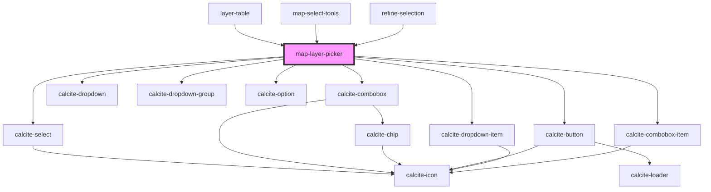

# map-layer-picker

<!-- Auto Generated Below -->

## Properties

| Property           | Attribute          | Description                                                                                            | Type                                   | Default         |
| ------------------ | ------------------ | ------------------------------------------------------------------------------------------------------ | -------------------------------------- | --------------- |
| `appearance`       | `appearance`       |                                                                                                        | `"solid" \| "transparent"`             | `"transparent"` |
| `enabledLayerIds`  | --                 | string[]: Optional list of enabled layer ids  If empty all layers will be available                    | `string[]`                             | `[]`            |
| `mapView`          | --                 | esri/views/View: https://developers.arcgis.com/javascript/latest/api-reference/esri-views-MapView.html | `MapView`                              | `undefined`     |
| `placeholderIcon`  | `placeholder-icon` | string: optional placeholder icon used with "combobox" type                                            | `string`                               | `""`            |
| `scale`            | `scale`            | "s" \| "m" \| "l": scale to render the component                                                       | `"l" \| "m" \| "s"`                    | `"m"`           |
| `selectedLayerIds` | --                 | string[]: list of layer ids that have been selected by the end user                                    | `string[]`                             | `[]`            |
| `type`             | `type`             | "select" \| "combobox" \| "dropdown": type of component to leverage                                    | `"combobox" \| "dropdown" \| "select"` | `"select"`      |

## Events

| Event                  | Description                                | Type                    |
| ---------------------- | ------------------------------------------ | ----------------------- |
| `layerSelectionChange` | Emitted on demand when a layer is selected | `CustomEvent<string[]>` |

## Dependencies

### Used by

 - [layer-table](../layer-table)
 - [map-select-tools](../map-select-tools)
 - [refine-selection](../refine-selection)

### Depends on

- calcite-select
- calcite-combobox
- calcite-dropdown
- calcite-button
- calcite-dropdown-group
- calcite-dropdown-item
- calcite-option
- calcite-combobox-item

### Graph

----------------------------------------------

*Built with [StencilJS](https://stenciljs.com/)*
