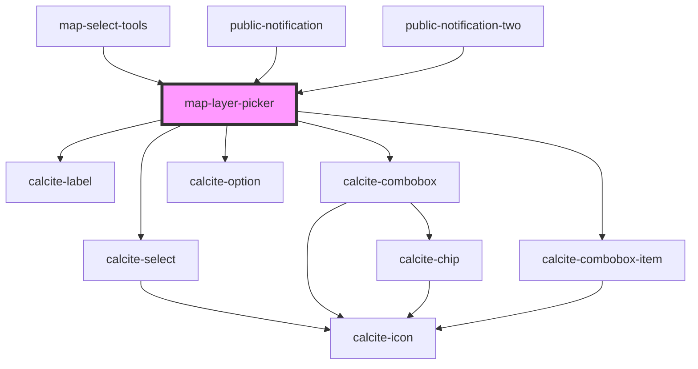

# map-layer-picker

<!-- Auto Generated Below -->

## Properties

| Property         | Attribute        | Description                                                                                            | Type                  | Default     |
| ---------------- | ---------------- | ------------------------------------------------------------------------------------------------------ | --------------------- | ----------- |
| `label`          | `label`          |                                                                                                        | `string`              | `""`        |
| `layerNames`     | --               |                                                                                                        | `string[]`            | `[]`        |
| `mapView`        | --               | esri/views/View: https://developers.arcgis.com/javascript/latest/api-reference/esri-views-MapView.html | `MapView`             | `undefined` |
| `selectedLayers` | --               |                                                                                                        | `string[]`            | `[]`        |
| `selectionMode`  | `selection-mode` |                                                                                                        | `"multi" \| "single"` | `"single"`  |
| `translations`   | `translations`   | Contains the translations for this component.                                                          | `any`                 | `{}`        |

## Events

| Event                  | Description | Type               |
| ---------------------- | ----------- | ------------------ |
| `layerSelectionChange` |             | `CustomEvent<any>` |

## Dependencies

### Used by

 - [map-select-tools](../map-select-tools)
 - [public-notification](../public-notification)
 - [public-notification-two](../public-notification-two)

### Depends on

- calcite-label
- calcite-select
- calcite-combobox
- calcite-combobox-item
- calcite-option

### Graph

----------------------------------------------

*Built with [StencilJS](https://stenciljs.com/)*
