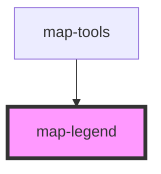

# map-legend

<!-- Auto Generated Below -->

## Properties

| Property       | Attribute | Description                                                                                                                  | Type      | Default     |
| -------------- | --------- | ---------------------------------------------------------------------------------------------------------------------------- | --------- | ----------- |
| `legendWidget` | --        | esri/widgets/Legend: https://developers.arcgis.com/javascript/latest/api-reference/esri-widgets-Legend.html  Legend instance | `Legend`  | `undefined` |
| `mapView`      | --        | esri/views/View: https://developers.arcgis.com/javascript/latest/api-reference/esri-views-MapView.html                       | `MapView` | `undefined` |

## Dependencies

### Used by

 - [map-tools](../map-tools)

### Graph

----------------------------------------------

*Built with [StencilJS](https://stenciljs.com/)*
