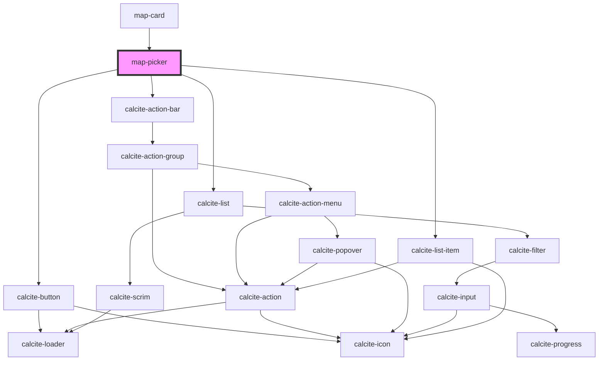

# map-picker

<!-- Auto Generated Below -->

## Properties

| Property   | Attribute | Description                                  | Type         | Default |
| ---------- | --------- | -------------------------------------------- | ------------ | ------- |
| `mapInfos` | --        | IMapInfo[]: array of map infos (name and id) | `IMapInfo[]` | `[]`    |

## Events

| Event           | Description                      | Type                    |
| --------------- | -------------------------------- | ----------------------- |
| `mapInfoChange` | Emitted when a new map is loaded | `CustomEvent<IMapInfo>` |

## Dependencies

### Used by

 - [map-card](../map-card)

### Depends on

- calcite-button
- calcite-action-bar
- calcite-list
- calcite-list-item

### Graph

----------------------------------------------

*Built with [StencilJS](https://stenciljs.com/)*
