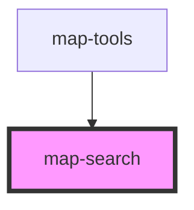

# map-search

<!-- Auto Generated Below -->

## Properties

| Property               | Attribute                | Description                                                                                                 | Type                   | Default     |
| ---------------------- | ------------------------ | ----------------------------------------------------------------------------------------------------------- | ---------------------- | ----------- |
| `mapView`              | --                       | esri/views/MapView: https://developers.arcgis.com/javascript/latest/api-reference/esri-views-MapView.html   | `MapView`              | `undefined` |
| `popupEnabled`         | `popup-enabled`          | boolean: When true the selected feature popup will be shown when serach result is found                     | `boolean`              | `false`     |
| `resultGraphicEnabled` | `result-graphic-enabled` | boolean: When true a graphic will be added for the search result                                            | `boolean`              | `false`     |
| `searchConfiguration`  | --                       | ISearchConfiguration: Configuration details for the Search widget                                           | `ISearchConfiguration` | `undefined` |
| `searchTerm`           | `search-term`            | string: Text entered by the end user. Used to search against the locator.                                   | `string`               | `undefined` |
| `searchWidget`         | --                       | esri/widgets/Search: https://developers.arcgis.com/javascript/latest/api-reference/esri-widgets-Search.html | `widgetsSearch`        | `undefined` |

## Dependencies

### Used by

 - [map-tools](../map-tools)

### Graph

----------------------------------------------

*Built with [StencilJS](https://stenciljs.com/)*
