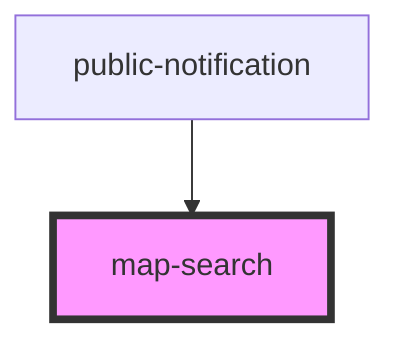

# map-search

<!-- Auto Generated Below -->

## Properties

| Property  | Attribute | Description                                                                                            | Type      | Default     |
| --------- | --------- | ------------------------------------------------------------------------------------------------------ | --------- | ----------- |
| `mapView` | --        | esri/views/View: https://developers.arcgis.com/javascript/latest/api-reference/esri-views-MapView.html | `MapView` | `undefined` |

## Events

| Event          | Description | Type                         |
| -------------- | ----------- | ---------------------------- |
| `searchChange` |             | `CustomEvent<ISearchResult>` |

## Methods

### `clear() => Promise<void>`

#### Returns

Type: `Promise<void>`

## Dependencies

### Used by

 - [public-notification](../public-notification)

### Graph

----------------------------------------------

*Built with [StencilJS](https://stenciljs.com/)*
