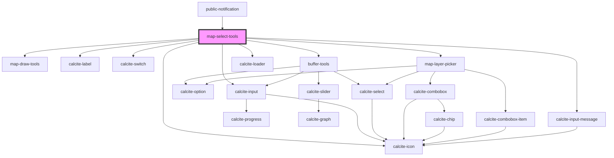

# map-select-tools

<!-- Auto Generated Below -->

## Properties

| Property                | Attribute                 | Description                                                                                                                                                | Type                                            | Default               |
| ----------------------- | ------------------------- | ---------------------------------------------------------------------------------------------------------------------------------------------------------- | ----------------------------------------------- | --------------------- |
| `bufferColor`           | `buffer-color`            | string \| number[] \|  object with r, g, b, a: https://developers.arcgis.com/javascript/latest/api-reference/esri-Color.html                               | `any`                                           | `[227, 139, 79, 0.8]` |
| `bufferOutlineColor`    | `buffer-outline-color`    | string \| number[] \| object with r, g, b, a: https://developers.arcgis.com/javascript/latest/api-reference/esri-Color.html                                | `any`                                           | `[255, 255, 255]`     |
| `customLabelEnabled`    | `custom-label-enabled`    | boolean: When true the user can define a name for each notification list                                                                                   | `boolean`                                       | `undefined`           |
| `defaultBufferDistance` | `default-buffer-distance` | number: The default value to show for the buffer distance                                                                                                  | `number`                                        | `undefined`           |
| `defaultBufferUnit`     | `default-buffer-unit`     | number: The default value to show for the buffer unit                                                                                                      | `"feet" \| "kilometers" \| "meters" \| "miles"` | `undefined`           |
| `enabledLayerIds`       | --                        | string[]: Optional list of enabled layer ids  If empty all layers will be available                                                                        | `string[]`                                      | `[]`                  |
| `geometries`            | --                        | esri/geometry: https://developers.arcgis.com/javascript/latest/api-reference/esri-geometry.html                                                            | `Geometry[]`                                    | `[]`                  |
| `isUpdate`              | `is-update`               | boolean: When true a new label is not generated for the stored selection set                                                                               | `boolean`                                       | `false`               |
| `layerViews`            | --                        | esri/views/layers/FeatureLayerView: https://developers.arcgis.com/javascript/latest/api-reference/esri-views-layers-FeatureLayerView.html                  | `FeatureLayerView[]`                            | `[]`                  |
| `mapView`               | --                        | esri/views/View: https://developers.arcgis.com/javascript/latest/api-reference/esri-views-MapView.html                                                     | `MapView`                                       | `undefined`           |
| `noResultText`          | `no-result-text`          | string: The value to show for no results when left empty the default text "0 selected features from {layerTitle}" will be shown                            | `string`                                        | `undefined`           |
| `searchConfiguration`   | --                        | ISearchConfiguration: Configuration details for the Search widget                                                                                          | `ISearchConfiguration`                          | `undefined`           |
| `selectLayerView`       | --                        | esri/views/layers/FeatureLayerView: https://developers.arcgis.com/javascript/latest/api-reference/esri-views-layers-FeatureLayerView.html                  | `FeatureLayerView`                              | `undefined`           |
| `selectionSet`          | --                        | utils/interfaces/ISelectionSet: Used to store key details about any selections that have been made.                                                        | `ISelectionSet`                                 | `undefined`           |
| `sketchLineSymbol`      | --                        | esri/symbols/SimpleLineSymbol \| JSON representation : https://developers.arcgis.com/javascript/latest/api-reference/esri-symbols-SimpleLineSymbol.html    | `SimpleLineSymbol`                              | `undefined`           |
| `sketchPointSymbol`     | --                        | esri/symbols/SimpleMarkerSymbol \| JSON representation: https://developers.arcgis.com/javascript/latest/api-reference/esri-symbols-SimpleMarkerSymbol.html | `SimpleMarkerSymbol`                            | `undefined`           |
| `sketchPolygonSymbol`   | --                        | esri/symbols/SimpleFillSymbol \| JSON representation: https://developers.arcgis.com/javascript/latest/api-reference/esri-symbols-SimpleFillSymbol.html     | `SimpleFillSymbol`                              | `undefined`           |

## Events

| Event                | Description                                       | Type                  |
| -------------------- | ------------------------------------------------- | --------------------- |
| `selectionSetChange` | Emitted on demand when the selection set changes. | `CustomEvent<number>` |

## Methods

### `clearSelection() => Promise<void>`

Clear any selection results

#### Returns

Type: `Promise<void>`

Promise when the results have been cleared

### `getSelection() => Promise<ISelectionSet>`

Get the new selection set

#### Returns

Type: `Promise<ISelectionSet>`

Promise with the new selection set

## Dependencies

### Used by

 - [public-notification](../public-notification)

### Depends on

- [map-draw-tools](../map-draw-tools)
- calcite-label
- calcite-switch
- [buffer-tools](../buffer-tools)
- [map-layer-picker](../map-layer-picker)
- calcite-loader
- calcite-icon
- calcite-input-message
- calcite-input

### Graph

----------------------------------------------

*Built with [StencilJS](https://stenciljs.com/)*
