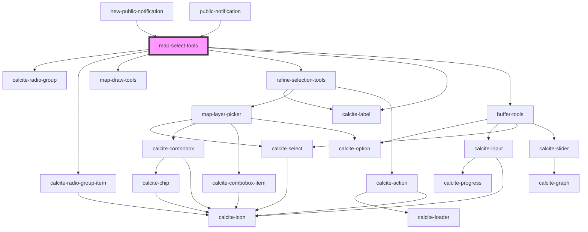

# map-select-tools

<!-- Auto Generated Below -->

## Properties

| Property          | Attribute   | Description                                                                                                                               | Type               | Default     |
| ----------------- | ----------- | ----------------------------------------------------------------------------------------------------------------------------------------- | ------------------ | ----------- |
| `geometries`      | --          | esri/geometry: https://developers.arcgis.com/javascript/latest/api-reference/esri-geometry.html                                           | `Geometry[]`       | `undefined` |
| `isUpdate`        | `is-update` | boolean: When true a new label is not generated for the stored selection set                                                              | `boolean`          | `false`     |
| `mapView`         | --          | esri/views/View: https://developers.arcgis.com/javascript/latest/api-reference/esri-views-MapView.html                                    | `MapView`          | `undefined` |
| `selectLayerView` | --          | esri/views/layers/FeatureLayerView: https://developers.arcgis.com/javascript/latest/api-reference/esri-views-layers-FeatureLayerView.html | `FeatureLayerView` | `undefined` |
| `selectionSet`    | --          | utils/interfaces/ISelectionSet: Used to store key details about any selections that have been made.                                       | `ISelectionSet`    | `undefined` |

## Events

| Event                | Description | Type               |
| -------------------- | ----------- | ------------------ |
| `selectionSetChange` |             | `CustomEvent<any>` |
| `workflowTypeChange` |             | `CustomEvent<any>` |

## Methods

### `clearSelection() => Promise<void>`

#### Returns

Type: `Promise<void>`

### `getSelectType() => Promise<EWorkflowType>`

#### Returns

Type: `Promise<EWorkflowType>`

### `getSelectedIds() => Promise<number[]>`

#### Returns

Type: `Promise<number[]>`

### `getSelection() => Promise<ISelectionSet>`

#### Returns

Type: `Promise<ISelectionSet>`

### `getSelectionLabel() => Promise<string>`

#### Returns

Type: `Promise<string>`

## Dependencies

### Used by

 - [new-public-notification](../new-public-notification)
 - [public-notification](../public-notification)

### Depends on

- calcite-radio-group
- calcite-radio-group-item
- [map-draw-tools](../map-draw-tools)
- [refine-selection-tools](../refine-selection-tools)
- calcite-label
- [buffer-tools](../buffer-tools)

### Graph

----------------------------------------------

*Built with [StencilJS](https://stenciljs.com/)*
