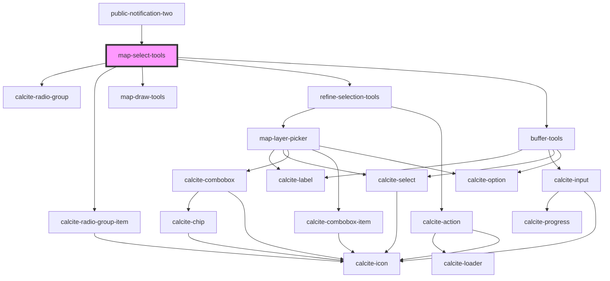

# map-select-tools

<!-- Auto Generated Below -->

## Properties

| Property       | Attribute       | Description                                                                                            | Type                                                                   | Default                |
| -------------- | --------------- | ------------------------------------------------------------------------------------------------------ | ---------------------------------------------------------------------- | ---------------------- |
| `geometries`   | --              |                                                                                                        | `Geometry[]`                                                           | `undefined`            |
| `isUpdate`     | `is-update`     |                                                                                                        | `boolean`                                                              | `false`                |
| `mapView`      | --              | esri/views/View: https://developers.arcgis.com/javascript/latest/api-reference/esri-views-MapView.html | `MapView`                                                              | `undefined`            |
| `searchLayers` | --              |                                                                                                        | `Layer[]`                                                              | `undefined`            |
| `searchTerm`   | `search-term`   |                                                                                                        | `string`                                                               | `undefined`            |
| `selectLayer`  | --              |                                                                                                        | `FeatureLayerView`                                                     | `undefined`            |
| `selectionSet` | --              |                                                                                                        | `ISelectionSet`                                                        | `undefined`            |
| `translations` | `translations`  |                                                                                                        | `any`                                                                  | `{}`                   |
| `workflowType` | `workflow-type` |                                                                                                        | `EWorkflowType.SEARCH \| EWorkflowType.SELECT \| EWorkflowType.SKETCH` | `EWorkflowType.SEARCH` |

## Events

| Event                | Description | Type               |
| -------------------- | ----------- | ------------------ |
| `selectionSetChange` |             | `CustomEvent<any>` |

## Methods

### `clearSelection() => Promise<void>`

#### Returns

Type: `Promise<void>`

### `getSelectType() => Promise<EWorkflowType>`

#### Returns

Type: `Promise<EWorkflowType>`

### `getSelectedIds() => Promise<number[]>`

#### Returns

Type: `Promise<number[]>`

### `getSelection() => Promise<ISelectionSet>`

#### Returns

Type: `Promise<ISelectionSet>`

### `getSelectionLabel() => Promise<string>`

#### Returns

Type: `Promise<string>`

## Dependencies

### Used by

 - [public-notification-two](../public-notification-two)

### Depends on

- calcite-radio-group
- calcite-radio-group-item
- [map-draw-tools](../map-draw-tools)
- [refine-selection-tools](../refine-selection-tools)
- [buffer-tools](../buffer-tools)

### Graph

----------------------------------------------

*Built with [StencilJS](https://stenciljs.com/)*
