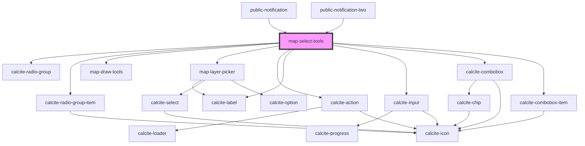

# map-select-tools

<!-- Auto Generated Below -->

## Properties

| Property       | Attribute       | Description                                                                                                 | Type                                                                   | Default                |
| -------------- | --------------- | ----------------------------------------------------------------------------------------------------------- | ---------------------------------------------------------------------- | ---------------------- |
| `mapView`      | --              | esri/views/View: https://developers.arcgis.com/javascript/latest/api-reference/esri-views-MapView.html      | `MapView`                                                              | `undefined`            |
| `searchLayers` | --              |                                                                                                             | `Layer[]`                                                              | `undefined`            |
| `searchWidget` | --              | esri/widgets/Search: https://developers.arcgis.com/javascript/latest/api-reference/esri-widgets-Search.html | `widgetsSearch`                                                        | `undefined`            |
| `translations` | `translations`  |                                                                                                             | `any`                                                                  | `{}`                   |
| `workflowType` | `workflow-type` |                                                                                                             | `EWorkflowType.SEARCH \| EWorkflowType.SELECT \| EWorkflowType.SKETCH` | `EWorkflowType.SEARCH` |

## Events

| Event                  | Description | Type               |
| ---------------------- | ----------- | ------------------ |
| `searchDistanceChange` |             | `CustomEvent<any>` |
| `searchGraphicsChange` |             | `CustomEvent<any>` |
| `selectionSetChange`   |             | `CustomEvent<any>` |

## Dependencies

### Used by

 - [public-notification](../public-notification)
 - [public-notification-two](../public-notification-two)

### Depends on

- calcite-radio-group
- calcite-radio-group-item
- [map-draw-tools](../map-draw-tools)
- [map-layer-picker](../map-layer-picker)
- calcite-action
- calcite-label
- calcite-input
- calcite-combobox
- calcite-combobox-item

### Graph

----------------------------------------------

*Built with [StencilJS](https://stenciljs.com/)*
