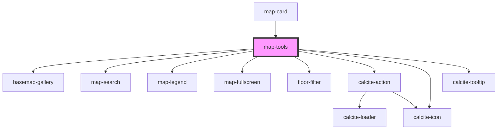

# map-tools

<!-- Auto Generated Below -->

## Properties

| Property               | Attribute                 | Description                                                                                                                                | Type                         | Default      |
| ---------------------- | ------------------------- | ------------------------------------------------------------------------------------------------------------------------------------------ | ---------------------------- | ------------ |
| `basemapConfig`        | --                        | IBasemapConfig: List of any basemaps to filter out from the basemap widget                                                                 | `IBasemapConfig`             | `undefined`  |
| `enableBasemap`        | `enable-basemap`          | boolean: when true the basemap widget will be available                                                                                    | `boolean`                    | `undefined`  |
| `enableFloorFilter`    | `enable-floor-filter`     | boolean: when true the floor filter widget will be available                                                                               | `boolean`                    | `undefined`  |
| `enableFullscreen`     | `enable-fullscreen`       | boolean: when true the fullscreen widget will be available                                                                                 | `boolean`                    | `undefined`  |
| `enableLegend`         | `enable-legend`           | boolean: when true the legend widget will be available                                                                                     | `boolean`                    | `undefined`  |
| `enableMapToolsExpand` | `enable-map-tools-expand` | boolean: when true map tools will be displayed within a expand/collapse widget                                                             | `boolean`                    | `undefined`  |
| `enableSearch`         | `enable-search`           | boolean: when true the search widget will be available                                                                                     | `boolean`                    | `undefined`  |
| `homeZoomToolsSize`    | `home-zoom-tools-size`    | "s" \| "m" \| "l": Used for Zoom and Home tools                                                                                            | `"l" \| "m" \| "s"`          | `"m"`        |
| `layout`               | `layout`                  | "horizontal" \| "vertical": used to control the orientation of the tools                                                                   | `"horizontal" \| "vertical"` | `"vertical"` |
| `mapView`              | --                        | esri/views/View: https://developers.arcgis.com/javascript/latest/api-reference/esri-views-MapView.html                                     | `MapView`                    | `undefined`  |
| `mapWidgetsSize`       | `map-widgets-size`        | "s" \| "m" \| "l": Used for optional map tool widget                                                                                       | `"l" \| "m" \| "s"`          | `"m"`        |
| `searchConfiguration`  | --                        | ISearchConfiguration: Configuration details for the Search widget                                                                          | `ISearchConfiguration`       | `undefined`  |
| `stackTools`           | `stack-tools`             | boolean: When true the map widget tools will have no margin between them. When false the map widget tools will have a margin between them. | `boolean`                    | `true`       |
| `toolOrder`            | --                        |  Valid tools: "legend", "search", "fullscreen", "basemap", "floorfilter"                                                                   | `string[]`                   | `undefined`  |

## Dependencies

### Used by

 - [map-card](../map-card)

### Depends on

- [basemap-gallery](../basemap-gallery)
- [map-search](../map-search)
- [map-legend](../map-legend)
- [map-fullscreen](../map-fullscreen)
- [floor-filter](../floor-filter)
- calcite-action
- calcite-icon
- calcite-tooltip

### Graph

----------------------------------------------

*Built with [StencilJS](https://stenciljs.com/)*
