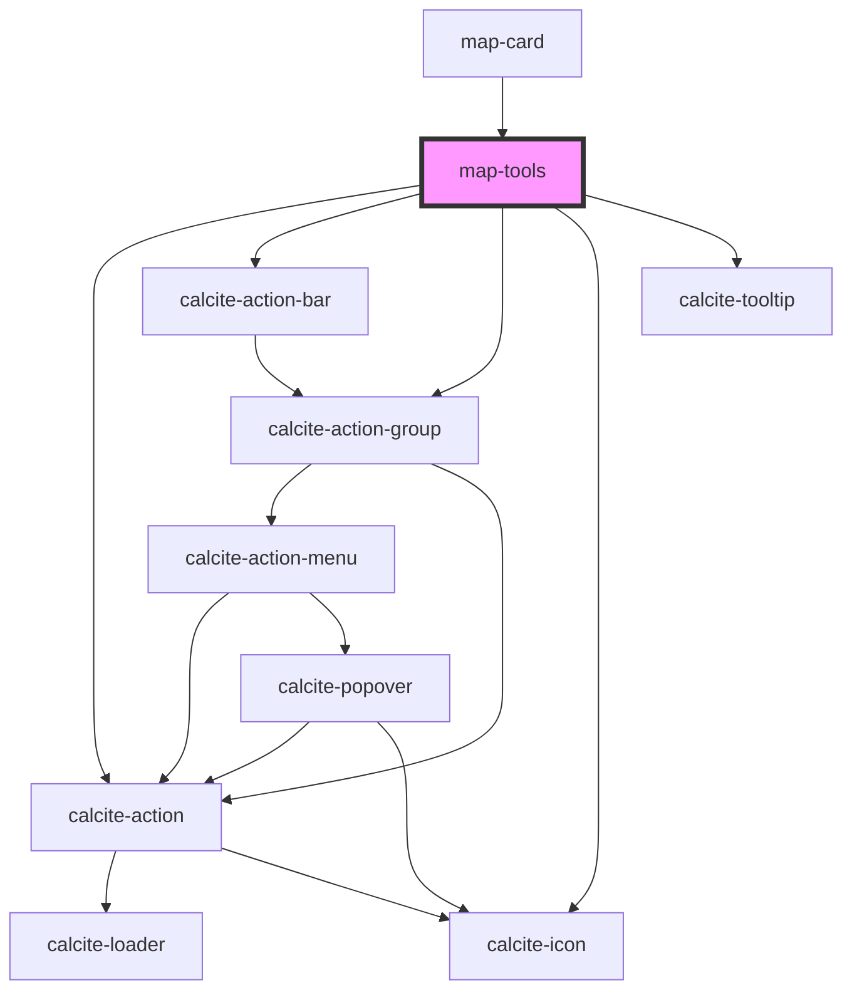

# map-tools

<!-- Auto Generated Below -->

## Properties

| Property  | Attribute | Description                                                                                            | Type                         | Default      |
| --------- | --------- | ------------------------------------------------------------------------------------------------------ | ---------------------------- | ------------ |
| `layout`  | `layout`  |                                                                                                        | `"horizontal" \| "vertical"` | `"vertical"` |
| `mapView` | --        | esri/views/View: https://developers.arcgis.com/javascript/latest/api-reference/esri-views-MapView.html | `MapView`                    | `undefined`  |

## Events

| Event       | Description                               | Type                                                      |
| ----------- | ----------------------------------------- | --------------------------------------------------------- |
| `expandMap` | Emitted when the expand button is clicked | `CustomEvent<EExpandType.COLLAPSE \| EExpandType.EXPAND>` |

## Dependencies

### Used by

 - [map-card](../map-card)

### Depends on

- calcite-action
- calcite-action-bar
- calcite-action-group
- calcite-icon
- calcite-tooltip

### Graph

----------------------------------------------

*Built with [StencilJS](https://stenciljs.com/)*
