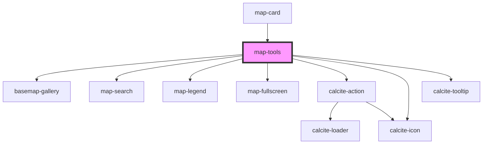

# map-tools

<!-- Auto Generated Below -->

## Properties

| Property              | Attribute           | Description                                                                                            | Type                         | Default      |
| --------------------- | ------------------- | ------------------------------------------------------------------------------------------------------ | ---------------------------- | ------------ |
| `basemapConfig`       | --                  | IBasemapConfig: List of any basemaps to filter out from the basemap widget                             | `IBasemapConfig`             | `undefined`  |
| `enableBasemap`       | `enable-basemap`    | boolean: when true the basemap widget will be available                                                | `boolean`                    | `undefined`  |
| `enableFullscreen`    | `enable-fullscreen` | boolean: when true the fullscreen widget will be available                                             | `boolean`                    | `undefined`  |
| `enableLegend`        | `enable-legend`     | boolean: when true the legend widget will be available                                                 | `boolean`                    | `undefined`  |
| `enableSearch`        | `enable-search`     | boolean: when true the search widget will be available                                                 | `boolean`                    | `undefined`  |
| `layout`              | `layout`            | "horizontal" \| "vertical": used to control the orientation of the tools                               | `"horizontal" \| "vertical"` | `"vertical"` |
| `mapView`             | --                  | esri/views/View: https://developers.arcgis.com/javascript/latest/api-reference/esri-views-MapView.html | `MapView`                    | `undefined`  |
| `searchConfiguration` | --                  | ISearchConfiguration: Configuration details for the Search widget                                      | `ISearchConfiguration`       | `undefined`  |

## Dependencies

### Used by

 - [map-card](../map-card)

### Depends on

- [basemap-gallery](../basemap-gallery)
- [map-search](../map-search)
- [map-legend](../map-legend)
- [map-fullscreen](../map-fullscreen)
- calcite-action
- calcite-icon
- calcite-tooltip

### Graph

----------------------------------------------

*Built with [StencilJS](https://stenciljs.com/)*
