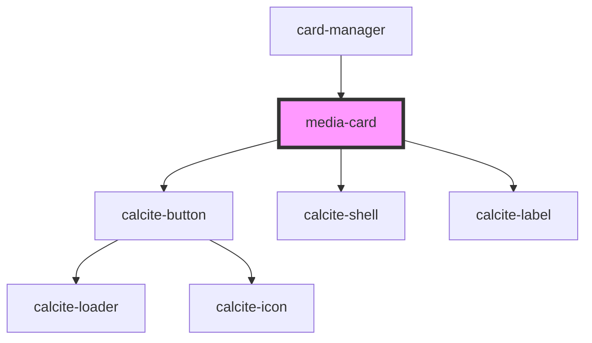

# media-card

<!-- Auto Generated Below -->

## Properties

| Property | Attribute | Description                                                                                   | Type                 | Default |
| -------- | --------- | --------------------------------------------------------------------------------------------- | -------------------- | ------- |
| `values` | --        | IMediaCardValues[]: Array of objects that contain the name, description, and image to display | `IMediaCardValues[]` | `[]`    |

## Dependencies

### Used by

 - [card-manager](../card-manager)

### Depends on

- calcite-button
- calcite-shell
- calcite-label

### Graph

----------------------------------------------

*Built with [StencilJS](https://stenciljs.com/)*
