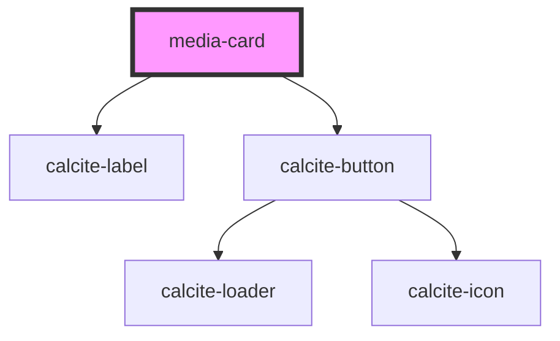

# media-card

<!-- Auto Generated Below -->

## Properties

| Property | Attribute | Description                                                                                   | Type                 | Default |
| -------- | --------- | --------------------------------------------------------------------------------------------- | -------------------- | ------- |
| `values` | --        | IMediaCardValues[]: Array of objects that contain the name, description, and image to display | `IMediaCardValues[]` | `[]`    |

## Dependencies

### Depends on

- calcite-label
- calcite-button

### Graph

----------------------------------------------

*Built with [StencilJS](https://stenciljs.com/)*
