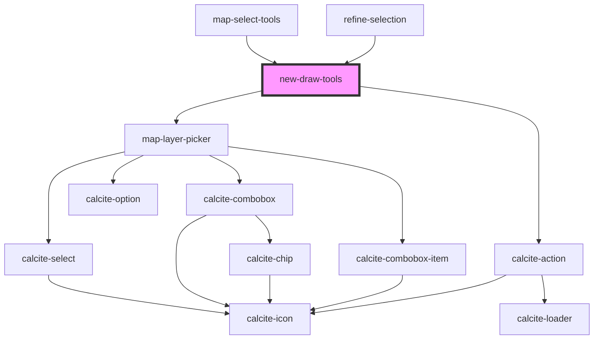

# new-draw-tools

<!-- Auto Generated Below -->

## Properties

| Property             | Attribute          | Description | Type                                           | Default     |
| -------------------- | ------------------ | ----------- | ---------------------------------------------- | ----------- |
| `active`             | `active`           |             | `boolean`                                      | `false`     |
| `drawToolsMode`      | `draw-tools-mode`  |             | `EDrawToolsMode.DRAW \| EDrawToolsMode.REFINE` | `undefined` |
| `enabledLayerIds`    | --                 |             | `string[]`                                     | `[]`        |
| `graphics`           | --                 |             | `Graphic[]`                                    | `undefined` |
| `ids`                | --                 |             | `number[]`                                     | `[]`        |
| `layerView`          | --                 |             | `FeatureLayerView`                             | `undefined` |
| `layerViews`         | --                 |             | `FeatureLayerView[]`                           | `[]`        |
| `mapView`            | --                 |             | `MapView`                                      | `undefined` |
| `mode`               | `mode`             |             | `ESelectionMode.ADD \| ESelectionMode.REMOVE`  | `undefined` |
| `pointSymbol`        | --                 |             | `SimpleMarkerSymbol`                           | `undefined` |
| `polygonSymbol`      | --                 |             | `SimpleFillSymbol`                             | `undefined` |
| `polylineSymbol`     | --                 |             | `SimpleLineSymbol`                             | `undefined` |
| `refineMode`         | `refine-mode`      |             | `ERefineMode.ALL \| ERefineMode.SUBSET`        | `undefined` |
| `refineSelectionSet` | --                 |             | `ISelectionSet`                                | `undefined` |
| `useLayerPicker`     | `use-layer-picker` |             | `boolean`                                      | `true`      |

## Events

| Event                           | Description | Type                                                |
| ------------------------------- | ----------- | --------------------------------------------------- |
| `refineSelectionGraphicsChange` |             | `CustomEvent<IRefineSelectionEvent>`                |
| `refineSelectionIdsChange`      |             | `CustomEvent<{ addIds: any[]; removeIds: any[]; }>` |
| `selectionLoadingChange`        |             | `CustomEvent<boolean>`                              |
| `sketchGraphicsChange`          |             | `CustomEvent<Graphic[]>`                            |

## Methods

### `clear() => Promise<void>`

#### Returns

Type: `Promise<void>`

### `clearHighlight() => Promise<void>`

#### Returns

Type: `Promise<void>`

### `reset() => Promise<void>`

#### Returns

Type: `Promise<void>`

## Dependencies

### Used by

 - [map-select-tools](../map-select-tools)
 - [refine-selection](../refine-selection)

### Depends on

- [map-layer-picker](../map-layer-picker)
- calcite-action

### Graph

----------------------------------------------

*Built with [StencilJS](https://stenciljs.com/)*
