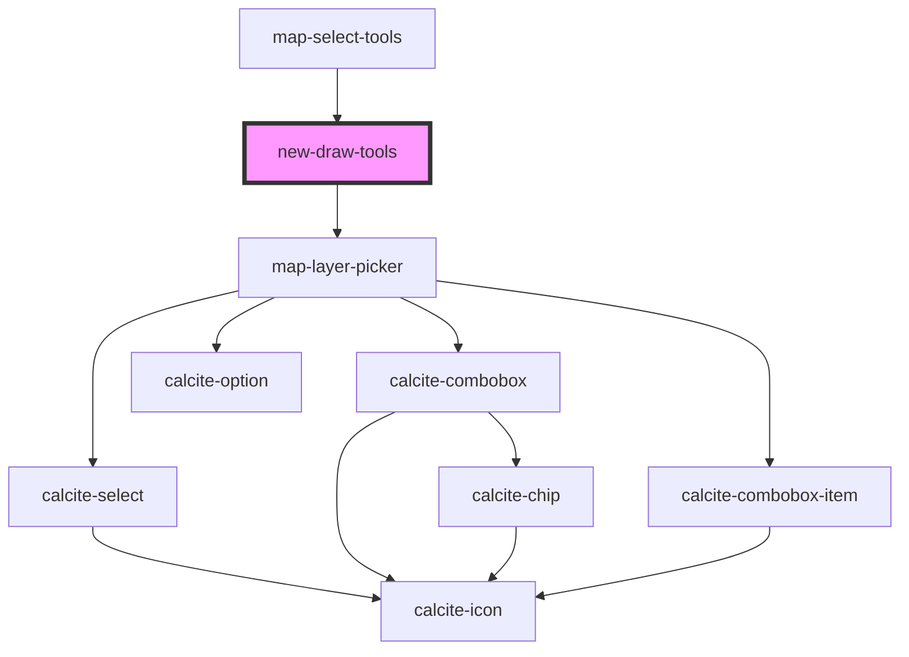

# new-draw-tools

<!-- Auto Generated Below -->

## Properties

| Property          | Attribute          | Description | Type                                           | Default     |
| ----------------- | ------------------ | ----------- | ---------------------------------------------- | ----------- |
| `active`          | `active`           |             | `boolean`                                      | `false`     |
| `drawToolsMode`   | `draw-tools-mode`  |             | `EDrawToolsMode.DRAW \| EDrawToolsMode.REFINE` | `undefined` |
| `enabledLayerIds` | --                 |             | `string[]`                                     | `[]`        |
| `graphics`        | --                 |             | `Graphic[]`                                    | `undefined` |
| `layerView`       | --                 |             | `FeatureLayerView`                             | `undefined` |
| `layerViews`      | --                 |             | `FeatureLayerView[]`                           | `[]`        |
| `mapView`         | --                 |             | `MapView`                                      | `undefined` |
| `pointSymbol`     | --                 |             | `SimpleMarkerSymbol`                           | `undefined` |
| `polygonSymbol`   | --                 |             | `SimpleFillSymbol`                             | `undefined` |
| `polylineSymbol`  | --                 |             | `SimpleLineSymbol`                             | `undefined` |
| `useLayerPicker`  | `use-layer-picker` |             | `boolean`                                      | `true`      |

## Events

| Event                          | Description | Type                                 |
| ------------------------------ | ----------- | ------------------------------------ |
| `layerSelectionGraphicsChange` |             | `CustomEvent<IRefineSelectionEvent>` |
| `selectionLoadingChange`       |             | `CustomEvent<boolean>`               |
| `sketchGraphicsChange`         |             | `CustomEvent<Graphic[]>`             |

## Methods

### `clear() => Promise<void>`

#### Returns

Type: `Promise<void>`

## Dependencies

### Used by

 - [map-select-tools](../map-select-tools)

### Depends on

- [map-layer-picker](../map-layer-picker)

### Graph

----------------------------------------------

*Built with [StencilJS](https://stenciljs.com/)*
