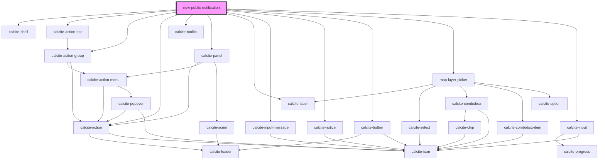

# new-public-notification

<!-- Auto Generated Below -->

## Properties

| Property          | Attribute | Description                                                                                                                               | Type               | Default     |
| ----------------- | --------- | ----------------------------------------------------------------------------------------------------------------------------------------- | ------------------ | ----------- |
| `addresseeLayer`  | --        | esri/views/layers/FeatureLayerView: https://developers.arcgis.com/javascript/latest/api-reference/esri-views-layers-FeatureLayerView.html | `FeatureLayerView` | `undefined` |
| `mapView`         | --        | esri/views/View: https://developers.arcgis.com/javascript/latest/api-reference/esri-views-MapView.html                                    | `MapView`          | `undefined` |
| `selectionLayers` | --        | esri/layers/Layer: https://developers.arcgis.com/javascript/latest/api-reference/esri-layers-Layer.html                                   | `Layer[]`          | `undefined` |

## Dependencies

### Depends on

- calcite-shell
- calcite-action-bar
- calcite-action-group
- calcite-action
- calcite-tooltip
- calcite-panel
- calcite-label
- calcite-input-message
- calcite-notice
- calcite-button
- [map-layer-picker](../map-layer-picker)
- calcite-input

### Graph

----------------------------------------------

*Built with [StencilJS](https://stenciljs.com/)*
