# new-public-notification

<!-- Auto Generated Below -->

## Properties

| Property          | Attribute | Description                                                                                                                               | Type                  | Default     |
| ----------------- | --------- | ----------------------------------------------------------------------------------------------------------------------------------------- | --------------------- | ----------- |
| `addresseeLayer`  | --        | esri/views/layers/FeatureLayerView: https://developers.arcgis.com/javascript/latest/api-reference/esri-views-layers-FeatureLayerView.html | `FeatureLayerView`    | `undefined` |
| `mapView`         | --        | esri/views/View: https://developers.arcgis.com/javascript/latest/api-reference/esri-views-MapView.html                                    | `MapView`             | `undefined` |
| `mode`            | `mode`    |                                                                                                                                           | `"express" \| "full"` | `"express"` |
| `selectionLayers` | --        | esri/layers/Layer: https://developers.arcgis.com/javascript/latest/api-reference/esri-layers-Layer.html                                   | `Layer[]`             | `undefined` |

## Dependencies

### Depends on

- calcite-shell
- calcite-action-bar
- calcite-action-group
- calcite-action
- calcite-tooltip
- calcite-panel
- calcite-label
- [map-layer-picker](../map-layer-picker)
- calcite-input-message
- calcite-button
- calcite-list
- calcite-list-item
- [map-draw-tools](../map-draw-tools)
- [buffer-tools](../buffer-tools)
- [map-select-tools](../map-select-tools)
- calcite-icon
- calcite-radio-group
- calcite-radio-group-item
- [refine-selection-tools](../refine-selection-tools)
- [pdf-download](../pdf-download)
- calcite-notice
- [map-search](../map-search)
- calcite-input

### Graph

```mermaid
graph TD;
  new-public-notification --> calcite-shell
  new-public-notification --> calcite-action-bar
  new-public-notification --> calcite-action-group
  new-public-notification --> calcite-action
  new-public-notification --> calcite-tooltip
  new-public-notification --> calcite-panel
  new-public-notification --> calcite-label
  new-public-notification --> map-layer-picker
  new-public-notification --> calcite-input-message
  new-public-notification --> calcite-button
  new-public-notification --> calcite-list
  new-public-notification --> calcite-list-item
  new-public-notification --> map-draw-tools
  new-public-notification --> buffer-tools
  new-public-notification --> map-select-tools
  new-public-notification --> calcite-icon
  new-public-notification --> calcite-radio-group
  new-public-notification --> calcite-radio-group-item
  new-public-notification --> refine-selection-tools
  new-public-notification --> pdf-download
  new-public-notification --> calcite-notice
  new-public-notification --> map-search
  new-public-notification --> calcite-input
  calcite-action-bar --> calcite-action-group
  calcite-action-group --> calcite-action-menu
  calcite-action-group --> calcite-action
  calcite-action-menu --> calcite-action
  calcite-action-menu --> calcite-popover
  calcite-action --> calcite-loader
  calcite-action --> calcite-icon
  calcite-popover --> calcite-action
  calcite-popover --> calcite-icon
  calcite-panel --> calcite-action
  calcite-panel --> calcite-action-menu
  calcite-panel --> calcite-scrim
  calcite-scrim --> calcite-loader
  map-layer-picker --> calcite-select
  map-layer-picker --> calcite-combobox
  map-layer-picker --> calcite-combobox-item
  map-layer-picker --> calcite-option
  calcite-select --> calcite-icon
  calcite-combobox --> calcite-chip
  calcite-combobox --> calcite-icon
  calcite-chip --> calcite-icon
  calcite-combobox-item --> calcite-icon
  calcite-input-message --> calcite-icon
  calcite-button --> calcite-loader
  calcite-button --> calcite-icon
  buffer-tools --> calcite-option
  buffer-tools --> calcite-input
  buffer-tools --> calcite-select
  buffer-tools --> calcite-slider
  calcite-input --> calcite-progress
  calcite-input --> calcite-icon
  calcite-slider --> calcite-graph
  map-select-tools --> calcite-radio-group
  map-select-tools --> calcite-radio-group-item
  map-select-tools --> map-draw-tools
  map-select-tools --> refine-selection-tools
  map-select-tools --> calcite-label
  map-select-tools --> buffer-tools
  calcite-radio-group-item --> calcite-icon
  refine-selection-tools --> calcite-label
  refine-selection-tools --> map-layer-picker
  refine-selection-tools --> calcite-action
  pdf-download --> calcite-select
  pdf-download --> calcite-option
  calcite-notice --> calcite-icon
  style new-public-notification fill:#f9f,stroke:#333,stroke-width:4px
```

----------------------------------------------

*Built with [StencilJS](https://stenciljs.com/)*
