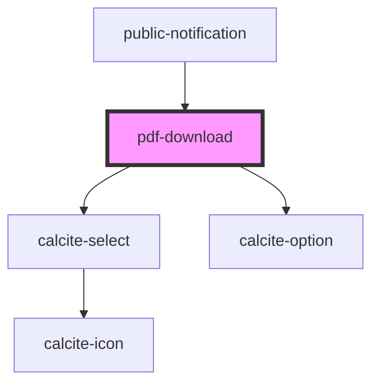

# pdf-download

<!-- Auto Generated Below -->

## Properties

| Property            | Attribute  | Description                                                                                                                               | Type               | Default     |
| ------------------- | ---------- | ----------------------------------------------------------------------------------------------------------------------------------------- | ------------------ | ----------- |
| `disabled`          | `disabled` | boolean: Controls the enabled/disabled state of download                                                                                  | `boolean`          | `true`      |
| `enabledSizeValues` | --         | string[]: Optional list of enabled size values for PDF export  If empty all sizes will be enabled                                         | `number[]`         | `[]`        |
| `layerView`         | --         | esri/views/layers/FeatureLayerView: https://developers.arcgis.com/javascript/latest/api-reference/esri-views-layers-FeatureLayerView.html | `FeatureLayerView` | `undefined` |

## Methods

### `downloadCSV(ids: number[], removeDuplicates: boolean, addColumnTitle: boolean) => Promise<void>`

Downloads csv of mailing labels for the provided list of ids

#### Returns

Type: `Promise<void>`

Promise resolving when function is done

### `downloadPDF(ids: number[], removeDuplicates: boolean) => Promise<void>`

Downloads pdf of mailing labels for the provided list of ids

#### Returns

Type: `Promise<void>`

Promise resolving when function is done

## Dependencies

### Used by

 - [public-notification](../public-notification)

### Depends on

- calcite-select
- calcite-option

### Graph

----------------------------------------------

*Built with [StencilJS](https://stenciljs.com/)*
