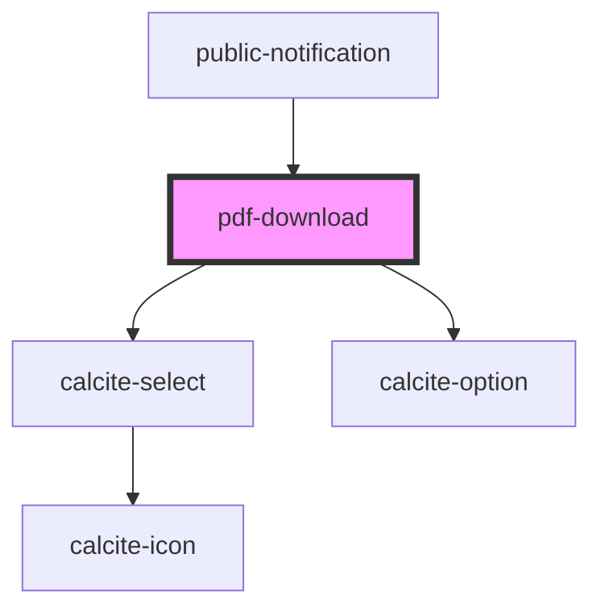

# pdf-download

<!-- Auto Generated Below -->

## Properties

| Property                  | Attribute                     | Description                                              | Type      | Default     |
| ------------------------- | ----------------------------- | -------------------------------------------------------- | --------- | ----------- |
| `defaultNumLabelsPerPage` | `default-num-labels-per-page` | number: The default number of labels per page to export  | `number`  | `undefined` |
| `disabled`                | `disabled`                    | boolean: Controls the enabled/disabled state of download | `boolean` | `false`     |

## Methods

### `downloadCSV(webmap: __esri.Map, exportInfos: IExportInfos, removeDuplicates: boolean, addColumnTitle?: boolean) => Promise<void>`

Downloads csv of mailing labels for the provided list of ids

#### Parameters

| Name               | Type           | Description                                                                             |
| ------------------ | -------------- | --------------------------------------------------------------------------------------- |
| `webmap`           | `Map`          | Webmap containing layer                                                                 |
| `exportInfos`      | `IExportInfos` | Information about items to be exported                                                  |
| `removeDuplicates` | `boolean`      | When true a single label is generated when multiple featues have a shared address value |
| `addColumnTitle`   | `boolean`      | Indicates if column headings should be included in output                               |

#### Returns

Type: `Promise<void>`

Promise resolving when function is done

### `downloadPDF(webmap: __esri.Map, exportInfos: IExportInfos, removeDuplicates?: boolean, title?: string, initialImageDataUrl?: string) => Promise<void>`

Downloads pdf of mailing labels for the provided list of ids

#### Parameters

| Name                  | Type           | Description                                                                             |
| --------------------- | -------------- | --------------------------------------------------------------------------------------- |
| `webmap`              | `Map`          | Webmap containing layer                                                                 |
| `exportInfos`         | `IExportInfos` | Information about items to be exported                                                  |
| `removeDuplicates`    | `boolean`      | When true a single label is generated when multiple featues have a shared address value |
| `title`               | `string`       | Title for each page                                                                     |
| `initialImageDataUrl` | `string`       | Data URL of image for first page                                                        |

#### Returns

Type: `Promise<void>`

Promise resolving when function is done

## Dependencies

### Used by

 - [public-notification](../public-notification)

### Depends on

- calcite-select
- calcite-option

### Graph

----------------------------------------------

*Built with [StencilJS](https://stenciljs.com/)*
