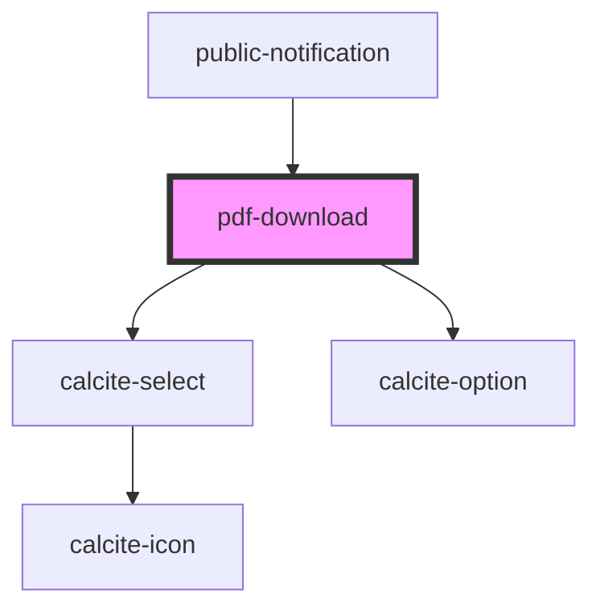

# pdf-download

<!-- Auto Generated Below -->

## Properties

| Property   | Attribute  | Description                                              | Type      | Default |
| ---------- | ---------- | -------------------------------------------------------- | --------- | ------- |
| `disabled` | `disabled` | boolean: Controls the enabled/disabled state of download | `boolean` | `false` |

## Methods

### `downloadCSV(layerView: __esri.FeatureLayerView, selectionSetNames: string[], ids: number[], removeDuplicates: boolean, addColumnTitle?: boolean) => Promise<void>`

Downloads csv of mailing labels for the provided list of ids

#### Returns

Type: `Promise<void>`

Promise resolving when function is done

### `downloadPDF(layerView: __esri.FeatureLayerView, selectionSetNames: string[], ids: number[], removeDuplicates: boolean) => Promise<void>`

Downloads pdf of mailing labels for the provided list of ids

#### Returns

Type: `Promise<void>`

Promise resolving when function is done

## Dependencies

### Used by

 - [public-notification](../public-notification)

### Depends on

- calcite-select
- calcite-option

### Graph

----------------------------------------------

*Built with [StencilJS](https://stenciljs.com/)*
