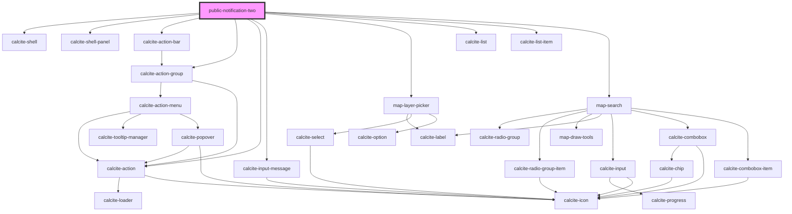

# public-notification-two

<!-- Auto Generated Below -->

## Properties

| Property          | Attribute          | Description                                                                                            | Type                                                     | Default          |
| ----------------- | ------------------ | ------------------------------------------------------------------------------------------------------ | -------------------------------------------------------- | ---------------- |
| `downloadEnabled` | `download-enabled` |                                                                                                        | `boolean`                                                | `false`          |
| `mapView`         | --                 | esri/views/View: https://developers.arcgis.com/javascript/latest/api-reference/esri-views-MapView.html | `MapView`                                                | `undefined`      |
| `message`         | `message`          |                                                                                                        | `string`                                                 | `""`             |
| `pageType`        | `page-type`        |                                                                                                        | `EPageType.LIST \| EPageType.REFINE \| EPageType.SELECT` | `EPageType.LIST` |
| `selectionLayers` | --                 |                                                                                                        | `Layer[]`                                                | `undefined`      |

## Dependencies

### Depends on

- calcite-shell
- calcite-shell-panel
- calcite-action-bar
- calcite-action-group
- calcite-action
- calcite-input-message
- [map-layer-picker](../map-layer-picker)
- calcite-list
- calcite-list-item
- [map-search](../map-search)

### Graph

----------------------------------------------

*Built with [StencilJS](https://stenciljs.com/)*
