# public-notification-two

<!-- Auto Generated Below -->

## Properties

| Property          | Attribute          | Description                                                                                            | Type                                                                                       | Default          |
| ----------------- | ------------------ | ------------------------------------------------------------------------------------------------------ | ------------------------------------------------------------------------------------------ | ---------------- |
| `downloadEnabled` | `download-enabled` |                                                                                                        | `boolean`                                                                                  | `false`          |
| `mapView`         | --                 | esri/views/View: https://developers.arcgis.com/javascript/latest/api-reference/esri-views-MapView.html | `MapView`                                                                                  | `undefined`      |
| `message`         | `message`          |                                                                                                        | `string`                                                                                   | `""`             |
| `pageType`        | `page-type`        |                                                                                                        | `EPageType.CSV \| EPageType.LIST \| EPageType.PDF \| EPageType.REFINE \| EPageType.SELECT` | `EPageType.LIST` |
| `selectionLayers` | --                 |                                                                                                        | `Layer[]`                                                                                  | `undefined`      |
| `selectionSet`    | --                 |                                                                                                        | `any[]`                                                                                    | `[]`             |
| `translations`    | `translations`     |                                                                                                        | `any`                                                                                      | `{}`             |

## Dependencies

### Depends on

- calcite-shell
- calcite-shell-panel
- calcite-action-bar
- calcite-action-group
- calcite-action
- calcite-input-message
- [map-layer-picker](../map-layer-picker)
- calcite-list
- calcite-list-item
- [map-select-tools](../map-select-tools)
- calcite-radio-group
- calcite-radio-group-item
- [refine-selection-tools](../refine-selection-tools)
- calcite-select
- calcite-option

### Graph

```mermaid
graph TD;
  public-notification-two --> calcite-shell
  public-notification-two --> calcite-shell-panel
  public-notification-two --> calcite-action-bar
  public-notification-two --> calcite-action-group
  public-notification-two --> calcite-action
  public-notification-two --> calcite-input-message
  public-notification-two --> map-layer-picker
  public-notification-two --> calcite-list
  public-notification-two --> calcite-list-item
  public-notification-two --> map-select-tools
  public-notification-two --> calcite-radio-group
  public-notification-two --> calcite-radio-group-item
  public-notification-two --> refine-selection-tools
  public-notification-two --> calcite-select
  public-notification-two --> calcite-option
  calcite-action-bar --> calcite-action-group
  calcite-action-group --> calcite-action-menu
  calcite-action-group --> calcite-action
  calcite-action-menu --> calcite-action
  calcite-action-menu --> calcite-tooltip-manager
  calcite-action-menu --> calcite-popover
  calcite-action --> calcite-loader
  calcite-action --> calcite-icon
  calcite-popover --> calcite-action
  calcite-popover --> calcite-icon
  calcite-input-message --> calcite-icon
  map-layer-picker --> calcite-label
  map-layer-picker --> calcite-select
  map-layer-picker --> calcite-combobox
  map-layer-picker --> calcite-combobox-item
  map-layer-picker --> calcite-option
  calcite-select --> calcite-icon
  calcite-combobox --> calcite-chip
  calcite-combobox --> calcite-icon
  calcite-chip --> calcite-icon
  calcite-combobox-item --> calcite-icon
  map-select-tools --> calcite-radio-group
  map-select-tools --> calcite-radio-group-item
  map-select-tools --> map-draw-tools
  map-select-tools --> map-layer-picker
  map-select-tools --> refine-selection-tools
  map-select-tools --> calcite-label
  map-select-tools --> calcite-input
  map-select-tools --> calcite-select
  map-select-tools --> calcite-option
  calcite-radio-group-item --> calcite-icon
  refine-selection-tools --> calcite-action
  calcite-input --> calcite-progress
  calcite-input --> calcite-icon
  style public-notification-two fill:#f9f,stroke:#333,stroke-width:4px
```

----------------------------------------------

*Built with [StencilJS](https://stenciljs.com/)*
