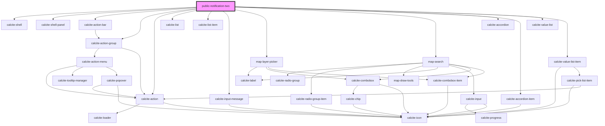

# public-notification-two

<!-- Auto Generated Below -->

## Properties

| Property              | Attribute               | Description                                                                                            | Type      | Default     |
| --------------------- | ----------------------- | ------------------------------------------------------------------------------------------------------ | --------- | ----------- |
| `downloadEnabled`     | `download-enabled`      |                                                                                                        | `boolean` | `false`     |
| `hasSelectedFeatures` | `has-selected-features` |                                                                                                        | `boolean` | `false`     |
| `mapView`             | --                      | esri/views/View: https://developers.arcgis.com/javascript/latest/api-reference/esri-views-MapView.html | `MapView` | `undefined` |
| `renderPage`          | `render-page`           |                                                                                                        | `boolean` | `false`     |
| `selectionActive`     | `selection-active`      |                                                                                                        | `boolean` | `false`     |
| `selectionLayers`     | --                      |                                                                                                        | `Layer[]` | `undefined` |

## Dependencies

### Depends on

- calcite-shell
- calcite-shell-panel
- calcite-action-bar
- calcite-action-group
- calcite-action
- calcite-list
- calcite-list-item
- calcite-input-message
- [map-layer-picker](../map-layer-picker)
- [map-search](../map-search)
- calcite-accordion
- calcite-accordion-item
- calcite-value-list
- calcite-value-list-item

### Graph

----------------------------------------------

*Built with [StencilJS](https://stenciljs.com/)*
