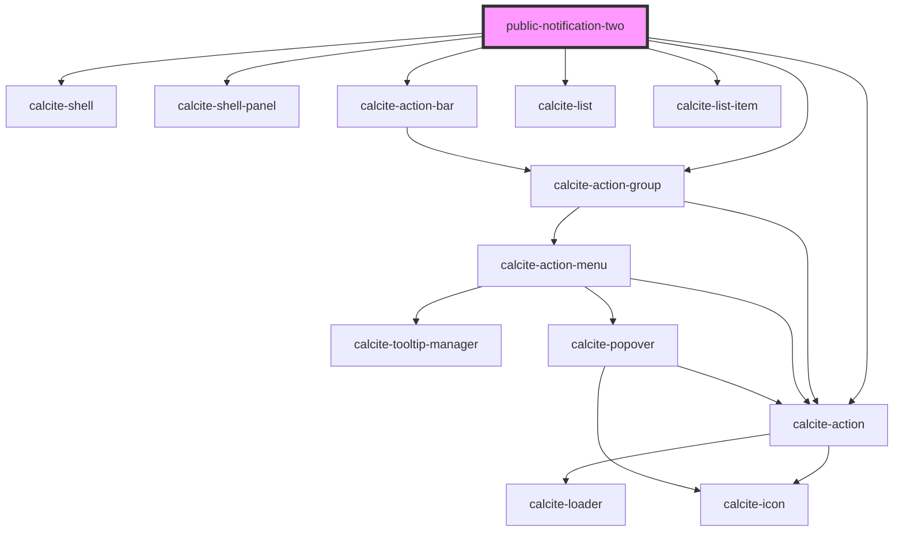

# public-notification-two

<!-- Auto Generated Below -->

## Properties

| Property          | Attribute | Description                                                                                            | Type      | Default     |
| ----------------- | --------- | ------------------------------------------------------------------------------------------------------ | --------- | ----------- |
| `mapView`         | --        | esri/views/View: https://developers.arcgis.com/javascript/latest/api-reference/esri-views-MapView.html | `MapView` | `undefined` |
| `selectionLayers` | --        |                                                                                                        | `Layer[]` | `undefined` |

## Dependencies

### Depends on

- calcite-shell
- calcite-shell-panel
- calcite-action-bar
- calcite-action-group
- calcite-action
- calcite-list
- calcite-list-item

### Graph

----------------------------------------------

*Built with [StencilJS](https://stenciljs.com/)*
