# public-notification

<!-- Auto Generated Below -->

## Properties

| Property                  | Attribute                   | Description                                                                                                                             | Type                                            | Default     |
| ------------------------- | --------------------------- | --------------------------------------------------------------------------------------------------------------------------------------- | ----------------------------------------------- | ----------- |
| `addresseeLayers`         | --                          | string[]: List of layer titles that should be shown as potential addressee layers                                                       | `string[]`                                      | `[]`        |
| `defaultBufferDistance`   | `default-buffer-distance`   | number: The default value to show for the buffer distance                                                                               | `number`                                        | `undefined` |
| `defaultBufferUnit`       | `default-buffer-unit`       | number: The default value to show for the buffer unit                                                                                   | `"feet" \| "kilometers" \| "meters" \| "miles"` | `undefined` |
| `exportOptions`           | --                          | IExportOptions: Set of options that control export capabilities  If not provided all export capabilities will be enabled.               | `IExportOptions`                                | `undefined` |
| `featureEffect`           | --                          | esri/layers/support/FeatureEffect: https://developers.arcgis.com/javascript/latest/api-reference/esri-layers-support-FeatureEffect.html | `FeatureEffect`                                 | `undefined` |
| `featureHighlightEnabled` | `feature-highlight-enabled` | boolean: When enabled features will be highlighted when their notification list item is clicked.                                        | `boolean`                                       | `undefined` |
| `mapView`                 | --                          | esri/views/View: https://developers.arcgis.com/javascript/latest/api-reference/esri-views-MapView.html                                  | `MapView`                                       | `undefined` |
| `noResultText`            | `no-result-text`            | string: The value to show for no results                                                                                                | `string`                                        | `undefined` |
| `searchConfiguration`     | --                          | ISearchConfiguration: Configuration details for the Search widget                                                                       | `ISearchConfiguration`                          | `undefined` |
| `selectionLayers`         | --                          | string[]: List of layer titles that should be shown as potential selection layers                                                       | `string[]`                                      | `[]`        |
| `showRefineSelection`     | `show-refine-selection`     | boolean: When true the refine selection workflow will be included in the UI                                                             | `boolean`                                       | `false`     |
| `showSearchSettings`      | `show-search-settings`      | boolean: When false no buffer distance or unit controls will be exposed                                                                 | `boolean`                                       | `true`      |

## Dependencies

### Depends on

- calcite-shell
- calcite-action-bar
- calcite-action-group
- calcite-action
- calcite-tooltip
- calcite-panel
- calcite-label
- calcite-input-message
- calcite-button
- [map-layer-picker](../map-layer-picker)
- calcite-list
- calcite-list-item
- calcite-modal
- [map-select-tools](../map-select-tools)
- calcite-icon
- [refine-selection](../refine-selection)
- calcite-checkbox
- [pdf-download](../pdf-download)
- calcite-notice

### Graph

```mermaid
graph TD;
  public-notification --> calcite-shell
  public-notification --> calcite-action-bar
  public-notification --> calcite-action-group
  public-notification --> calcite-action
  public-notification --> calcite-tooltip
  public-notification --> calcite-panel
  public-notification --> calcite-label
  public-notification --> calcite-input-message
  public-notification --> calcite-button
  public-notification --> map-layer-picker
  public-notification --> calcite-list
  public-notification --> calcite-list-item
  public-notification --> calcite-modal
  public-notification --> map-select-tools
  public-notification --> calcite-icon
  public-notification --> refine-selection
  public-notification --> calcite-checkbox
  public-notification --> pdf-download
  public-notification --> calcite-notice
  calcite-action-bar --> calcite-action-group
  calcite-action-group --> calcite-action-menu
  calcite-action-group --> calcite-action
  calcite-action-menu --> calcite-action
  calcite-action-menu --> calcite-popover
  calcite-action --> calcite-loader
  calcite-action --> calcite-icon
  calcite-popover --> calcite-action
  calcite-popover --> calcite-icon
  calcite-panel --> calcite-action
  calcite-panel --> calcite-action-menu
  calcite-panel --> calcite-scrim
  calcite-scrim --> calcite-loader
  calcite-input-message --> calcite-icon
  calcite-button --> calcite-loader
  calcite-button --> calcite-icon
  map-layer-picker --> calcite-select
  map-layer-picker --> calcite-combobox
  map-layer-picker --> calcite-combobox-item
  map-layer-picker --> calcite-option
  calcite-select --> calcite-icon
  calcite-combobox --> calcite-chip
  calcite-combobox --> calcite-icon
  calcite-chip --> calcite-icon
  calcite-combobox-item --> calcite-icon
  calcite-modal --> calcite-scrim
  calcite-modal --> calcite-icon
  map-select-tools --> calcite-radio-group
  map-select-tools --> calcite-radio-group-item
  map-select-tools --> calcite-label
  map-select-tools --> calcite-checkbox
  map-select-tools --> map-draw-tools
  map-select-tools --> refine-selection-tools
  map-select-tools --> buffer-tools
  calcite-radio-group-item --> calcite-icon
  refine-selection-tools --> map-layer-picker
  refine-selection-tools --> calcite-action
  buffer-tools --> calcite-option
  buffer-tools --> calcite-input
  buffer-tools --> calcite-select
  buffer-tools --> calcite-slider
  calcite-input --> calcite-progress
  calcite-input --> calcite-icon
  calcite-slider --> calcite-graph
  refine-selection --> calcite-radio-group
  refine-selection --> calcite-radio-group-item
  refine-selection --> refine-selection-tools
  refine-selection --> calcite-list
  refine-selection --> calcite-list-item
  pdf-download --> calcite-select
  pdf-download --> calcite-option
  calcite-notice --> calcite-icon
  style public-notification fill:#f9f,stroke:#333,stroke-width:4px
```

----------------------------------------------

*Built with [StencilJS](https://stenciljs.com/)*
