# public-notification

<!-- Auto Generated Below -->

## Properties

| Property                  | Attribute                   | Description                                                                                                                                                                                                                                                                                                                                                                                                 | Type                                            | Default               |
| ------------------------- | --------------------------- | ----------------------------------------------------------------------------------------------------------------------------------------------------------------------------------------------------------------------------------------------------------------------------------------------------------------------------------------------------------------------------------------------------------- | ----------------------------------------------- | --------------------- |
| `addresseeLayerIds`       | --                          | string[]: List of layer ids that should be shown as potential addressee layers                                                                                                                                                                                                                                                                                                                              | `string[]`                                      | `[]`                  |
| `bufferColor`             | `buffer-color`              | string \| number[] \|  object with r, g, b, a: https://developers.arcgis.com/javascript/latest/api-reference/esri-Color.html                                                                                                                                                                                                                                                                                | `any`                                           | `[227, 139, 79, 0.8]` |
| `bufferOutlineColor`      | `buffer-outline-color`      | string \| number[] \| object with r, g, b, a: https://developers.arcgis.com/javascript/latest/api-reference/esri-Color.html                                                                                                                                                                                                                                                                                 | `any`                                           | `[255, 255, 255]`     |
| `customLabelEnabled`      | `custom-label-enabled`      | boolean: When true the user can define a name for each notification list                                                                                                                                                                                                                                                                                                                                    | `boolean`                                       | `undefined`           |
| `defaultBufferDistance`   | `default-buffer-distance`   | number: The default value to show for the buffer distance                                                                                                                                                                                                                                                                                                                                                   | `number`                                        | `undefined`           |
| `defaultBufferUnit`       | `default-buffer-unit`       | number: The default value to show for the buffer unit ("feet"\|"meters"\|"miles"\|"kilometers")                                                                                                                                                                                                                                                                                                             | `"feet" \| "kilometers" \| "meters" \| "miles"` | `undefined`           |
| `featureEffect`           | --                          | The effect that will be applied when featureHighlightEnabled is true  esri/layers/support/FeatureEffect: https://developers.arcgis.com/javascript/latest/api-reference/esri-layers-support-FeatureEffect.html                                                                                                                                                                                               | `FeatureEffect`                                 | `undefined`           |
| `featureHighlightEnabled` | `feature-highlight-enabled` | boolean: When enabled features will be highlighted when their notification list item is clicked.                                                                                                                                                                                                                                                                                                            | `boolean`                                       | `undefined`           |
| `mapView`                 | --                          | esri/views/View: https://developers.arcgis.com/javascript/latest/api-reference/esri-views-MapView.html                                                                                                                                                                                                                                                                                                      | `MapView`                                       | `undefined`           |
| `noResultText`            | `no-result-text`            | string: The value to show for no results when left empty the default text "0 selected features from {layerTitle}" will be shown                                                                                                                                                                                                                                                                             | `string`                                        | `undefined`           |
| `searchConfiguration`     | --                          | ISearchConfiguration: Configuration details for the Search widget                                                                                                                                                                                                                                                                                                                                           | `ISearchConfiguration`                          | `undefined`           |
| `selectionLayerIds`       | --                          | string[]: List of layer ids that should be shown as potential selection layers when skectching with "Use layer features" option                                                                                                                                                                                                                                                                             | `string[]`                                      | `[]`                  |
| `showSearchSettings`      | `show-search-settings`      | boolean: When false no buffer distance or unit controls will be exposed                                                                                                                                                                                                                                                                                                                                     | `boolean`                                       | `true`                |
| `sketchLineSymbol`        | `sketch-line-symbol`        | esri/symbols/SimpleLineSymbol \| JSON representation : https://developers.arcgis.com/javascript/latest/api-reference/esri-symbols-SimpleLineSymbol.html  A JSON representation of the instance in the ArcGIS format. See the ArcGIS REST API documentation for examples of the structure of various input JSON objects. https://developers.arcgis.com/documentation/common-data-types/symbol-objects.htm    | `any`                                           | `undefined`           |
| `sketchPointSymbol`       | `sketch-point-symbol`       | esri/symbols/SimpleMarkerSymbol \| JSON representation: https://developers.arcgis.com/javascript/latest/api-reference/esri-symbols-SimpleMarkerSymbol.html  A JSON representation of the instance in the ArcGIS format. See the ArcGIS REST API documentation for examples of the structure of various input JSON objects. https://developers.arcgis.com/documentation/common-data-types/symbol-objects.htm | `any`                                           | `undefined`           |
| `sketchPolygonSymbol`     | `sketch-polygon-symbol`     | esri/symbols/SimpleFillSymbol \| JSON representation: https://developers.arcgis.com/javascript/latest/api-reference/esri-symbols-SimpleFillSymbol.html  A JSON representation of the instance in the ArcGIS format. See the ArcGIS REST API documentation for examples of the structure of various input JSON objects. https://developers.arcgis.com/documentation/common-data-types/symbol-objects.htm     | `any`                                           | `undefined`           |

## Events

| Event                       | Description                                                 | Type                                |
| --------------------------- | ----------------------------------------------------------- | ----------------------------------- |
| `labelChange`               | Emitted on demand when a buffer is generated.               | `CustomEvent<string>`               |
| `searchConfigurationChange` | Emitted on demand when searchConfiguration gets a new value | `CustomEvent<ISearchConfiguration>` |

## Dependencies

### Depends on

- calcite-shell
- calcite-action-bar
- calcite-action-group
- calcite-action
- calcite-tooltip
- calcite-panel
- calcite-label
- calcite-input-message
- calcite-button
- [map-layer-picker](../map-layer-picker)
- calcite-list
- calcite-list-item
- calcite-modal
- [map-select-tools](../map-select-tools)
- calcite-loader
- calcite-icon
- calcite-input
- calcite-checkbox
- [pdf-download](../pdf-download)
- calcite-input-text
- calcite-notice

### Graph

```mermaid
graph TD;
  public-notification --> calcite-shell
  public-notification --> calcite-action-bar
  public-notification --> calcite-action-group
  public-notification --> calcite-action
  public-notification --> calcite-tooltip
  public-notification --> calcite-panel
  public-notification --> calcite-label
  public-notification --> calcite-input-message
  public-notification --> calcite-button
  public-notification --> map-layer-picker
  public-notification --> calcite-list
  public-notification --> calcite-list-item
  public-notification --> calcite-modal
  public-notification --> map-select-tools
  public-notification --> calcite-loader
  public-notification --> calcite-icon
  public-notification --> calcite-input
  public-notification --> calcite-checkbox
  public-notification --> pdf-download
  public-notification --> calcite-input-text
  public-notification --> calcite-notice
  calcite-action-bar --> calcite-action-group
  calcite-action-group --> calcite-action-menu
  calcite-action-group --> calcite-action
  calcite-action-menu --> calcite-action
  calcite-action-menu --> calcite-popover
  calcite-action --> calcite-loader
  calcite-action --> calcite-icon
  calcite-popover --> calcite-action
  calcite-popover --> calcite-icon
  calcite-panel --> calcite-action
  calcite-panel --> calcite-action-menu
  calcite-panel --> calcite-scrim
  calcite-scrim --> calcite-loader
  calcite-input-message --> calcite-icon
  calcite-button --> calcite-loader
  calcite-button --> calcite-icon
  map-layer-picker --> calcite-select
  map-layer-picker --> calcite-combobox
  map-layer-picker --> calcite-combobox-item
  map-layer-picker --> calcite-option
  calcite-select --> calcite-icon
  calcite-combobox --> calcite-chip
  calcite-combobox --> calcite-icon
  calcite-chip --> calcite-icon
  calcite-combobox-item --> calcite-icon
  calcite-list --> calcite-scrim
  calcite-list --> calcite-filter
  calcite-filter --> calcite-input
  calcite-input --> calcite-progress
  calcite-input --> calcite-icon
  calcite-list-item --> calcite-icon
  calcite-modal --> calcite-scrim
  calcite-modal --> calcite-icon
  map-select-tools --> calcite-segmented-control
  map-select-tools --> calcite-segmented-control-item
  map-select-tools --> calcite-label
  map-select-tools --> calcite-checkbox
  map-select-tools --> map-draw-tools
  map-select-tools --> buffer-tools
  calcite-segmented-control-item --> calcite-icon
  map-draw-tools --> map-layer-picker
  buffer-tools --> calcite-option
  buffer-tools --> calcite-input
  buffer-tools --> calcite-select
  buffer-tools --> calcite-slider
  calcite-slider --> calcite-graph
  pdf-download --> calcite-select
  pdf-download --> calcite-option
  calcite-input-text --> calcite-progress
  calcite-input-text --> calcite-icon
  calcite-notice --> calcite-icon
  style public-notification fill:#f9f,stroke:#333,stroke-width:4px
```

----------------------------------------------

*Built with [StencilJS](https://stenciljs.com/)*
