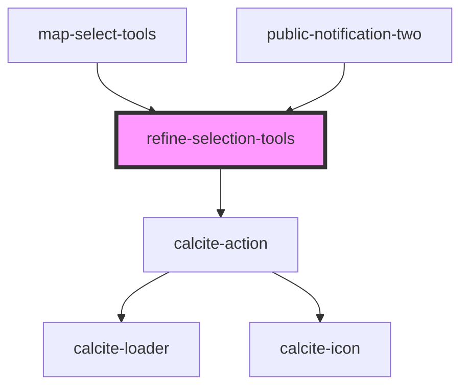

# refine-selection-tools

<!-- Auto Generated Below -->

## Properties

| Property       | Attribute      | Description | Type                                    | Default     |
| -------------- | -------------- | ----------- | --------------------------------------- | ----------- |
| `mapView`      | --             |             | `MapView`                               | `undefined` |
| `mode`         | `mode`         |             | `ERefineMode.ADD \| ERefineMode.REMOVE` | `undefined` |
| `searchLayers` | --             |             | `Layer[]`                               | `undefined` |
| `translations` | `translations` |             | `any`                                   | `{}`        |

## Dependencies

### Used by

 - [map-select-tools](../map-select-tools)
 - [public-notification-two](../public-notification-two)

### Depends on

- calcite-action

### Graph

----------------------------------------------

*Built with [StencilJS](https://stenciljs.com/)*
