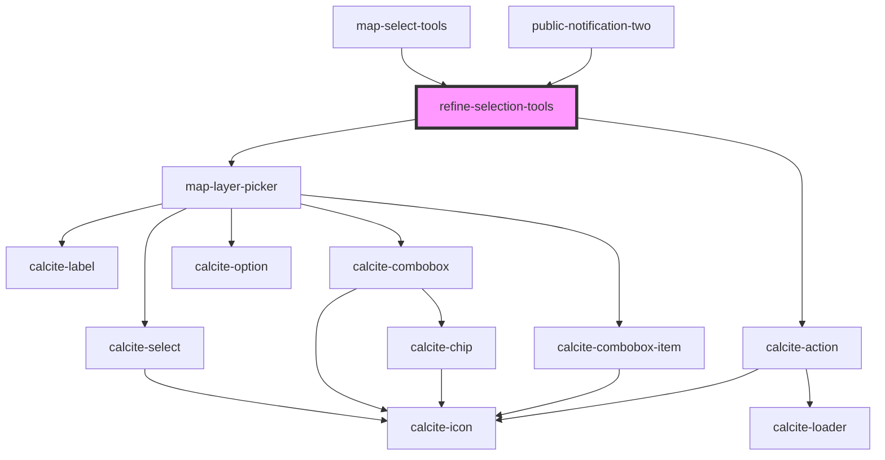

# refine-selection-tools

<!-- Auto Generated Below -->

## Properties

| Property         | Attribute          | Description | Type                                                                                        | Default     |
| ---------------- | ------------------ | ----------- | ------------------------------------------------------------------------------------------- | ----------- |
| `active`         | `active`           |             | `boolean`                                                                                   | `false`     |
| `graphics`       | --                 |             | `Graphic[]`                                                                                 | `undefined` |
| `ids`            | --                 |             | `number[]`                                                                                  | `[]`        |
| `layerView`      | --                 |             | `FeatureLayerView`                                                                          | `undefined` |
| `layerViews`     | --                 |             | `FeatureLayerView[]`                                                                        | `[]`        |
| `mapView`        | --                 |             | `MapView`                                                                                   | `undefined` |
| `mode`           | `mode`             |             | `ERefineMode.ADD \| ERefineMode.REMOVE`                                                     | `undefined` |
| `selectEnbaled`  | `select-enbaled`   |             | `boolean`                                                                                   | `false`     |
| `selectionMode`  | `selection-mode`   |             | `ESelectionMode.LINE \| ESelectionMode.POINT \| ESelectionMode.POLY \| ESelectionMode.RECT` | `undefined` |
| `translations`   | `translations`     |             | `any`                                                                                       | `{}`        |
| `useLayerPicker` | `use-layer-picker` |             | `boolean`                                                                                   | `true`      |

## Events

| Event                   | Description | Type               |
| ----------------------- | ----------- | ------------------ |
| `refineSelectionChange` |             | `CustomEvent<any>` |

## Dependencies

### Used by

 - [map-select-tools](../map-select-tools)
 - [public-notification-two](../public-notification-two)

### Depends on

- [map-layer-picker](../map-layer-picker)
- calcite-action

### Graph

----------------------------------------------

*Built with [StencilJS](https://stenciljs.com/)*
